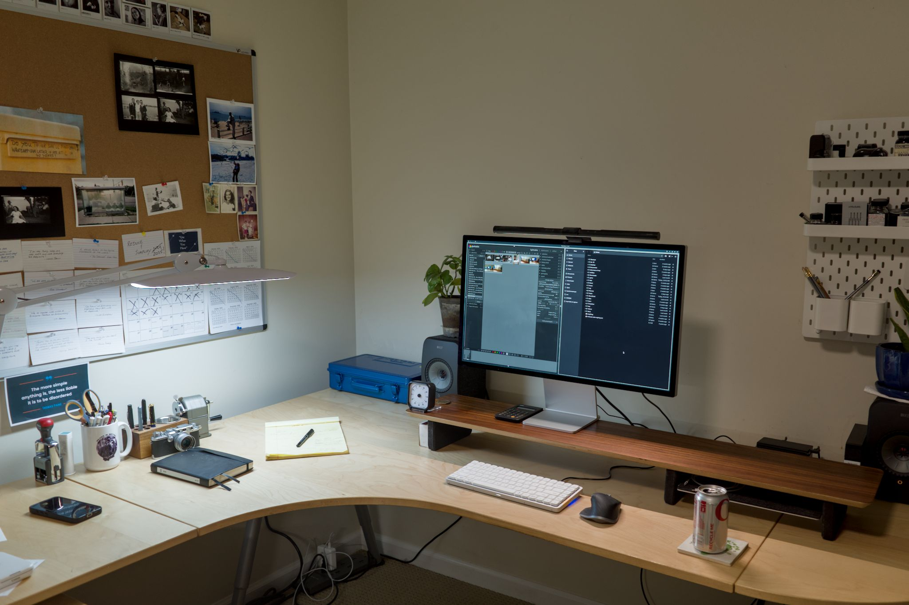

A list of things that I use to manage my life or that I simply enjoy using.

Last updated **October 16, 2025**.

## Computer Hardware

- [Framework 13](https://frame.work/laptop13) - I run Arch, btw. (Well, Omarchy, so close enough)
- [Beelink Ser8](https://www.bee-link.com/products/beelink-ser8-8845hs) - My desktop computer, also running Omarchy.
- ~~**Apple Mac Mini M2 (Max)** - A solid, capable, inconspicuous desktop computer. It's my photo processing station and home server.~~
- **Apple MacBook Air M4** – Powerful and tiny. My "Break glass in emergency" Mac.
- **Apple iPad Pro 10.9 (2021)** – I am not an iPad person, but this is a great “get-away” device. The Magic Keyboard makes it usable.
- **iPhone 15 Pro** – I’ve finally gone with a “full-size” phone. No more Minis. It’s fine.
- [**Apple Studio display**](https://www.apple.com/studio-display/) – Just the right size. Gorgeous view.
- **Lenovo ThinkPad X1 Carbon (2015)** – I tinker with Linux on this. I hate the trackpad more than anything.
- **Intel NUC i5** - Dedicated box for running Roon Core
- **Synology** - Plex server, Synology Photos, and file archives.
- [Lofree Flow84](https://www.lofree.co/products/lofree-flow-the-smoothest-mechanical-keyboard) Keyboard - It's no HHKB but I wanted real function and arrow keys.
- [**Logitech MX Master 3 mouse**](https://www.amazon.com/Logitech-MX-Master-3S-Graphite/dp/B09HM94VDS) - I still prefer a mouse over a trackpad. This is a good one.

## Software

Here’s the software that I currently use on a regular basis

- [**Emacs**](https://www.gnu.org/software/emacs/) and  [**Org mode**](https://orgmode.org/) – Notes, emails, RSS feeds, journaling, most everything.
- [**Ghostty**](https://ghostty.org/) – Apple’s built-in Terminal is fine, but I'm running with Ghostty because it's new and fun.
- **Apple Passwords** – Password management. It's finally good enough to replace 1Password for me.
- [**Espanso**](https://espanso.org/) - Text expansion utility. It’s free, cross-platform, fast, and appropriately nerdy.
- [**Signal**](https://signal.org/) – For non-Apple and/or private communication

## Services

- [**Hetzner**](https://www.hetzner.com/) \- Website hosting for baty.net and a couple others
- [**Fastmail**](https://fastmail.com/) - Personal email
- [**Porkbun**](https://porkbun.com/) - Domains and DNS

## Photography

**Cameras I use most frequently**

- **Leica MP (Black Paint)** - OMG it’s so beautiful. I bought it new in 2021 as my “forever” camera.
- **Leica SL2** (Digital) - Superb build and image quality. Best EVF I’ve ever used. And made for use with adapted M lenses.
- **Leica M3** - OG Leica M. Built in 1960 and works like butter.
- **Rolleiflex 2.8D** - Beautiful medium format TLR.
- **Olympus Stylus Epic** – Compact 35mm film camera. I love these little things.
- **Ricoh GRIII** (Digital) - Pocketable, high-quality (APS-C), and fun to use snapshot camera.
- **Fujifilm X100** - The original Fuji X camera. It’s 12 years old now, but I still use it, even though the rear buttons suck and it’s "only" 12 MP.

**Cameras I use occasionally**

- **Leica IIIf** – Barnack! Mine was made in 1946.
- **Hasselblad 500C/M** - The Hasselblad V series cameras are iconic, beautiful, and superbly engineered. They also produce wonderful images, which is why they are my favorite all-around cameras.
- **Graflex Crown Graphic** - Large Format (4×5) film camera. Mine is beat up and held together with gaffer tape, and I love it. It’s a pain in the ass to use, but there’s nothing like a 4×5 negative.
- **Canon Pro-zoom 814 Electronic** – Super8 movie film camera
- **Nikon F100** – 35mm auto-focus film camera. Best bang for the buck in film cameras.
- **Olympus OM–1n** – 35mm film camera. Tiny and jewel-like. Amazing viewfinder.
- **Olympus OM–2n** – 35mm film camera

**Retired cameras**

- **Canon AE–1 Program** – 35mm Film SLR. This is the first “real” camera I ever owned.
- **Canon Canonet** – 35mm rangefinder camera. Retired.
- **Minolta Autocord** – Medium format TLR. Retired.
- **Graflex Speed Graphic** – Another 4×5 film camera. Mine has a bad light leak so it sits on a shelf.

## Software for photography

- **Adobe Lightroom** – Raw file editor and library. Once a while I still use Capture One.
- **Apple Photos** – For when all I had was my phone
- **Adobe Bridge** - New-to-me photo browser. Replaces Photo Mechanic, which has become too expensive.

## Photo Hardware

- **Epson ET-8500** - “EcoTank” photo printer. Great photo printer that doesn’t cost a fortue to run.
- **Epson V850** – Flatbed film scanner. Works great for medium and large format. Less great for 35mm, but still fine.
- **Profoto D1 Monolights** – Aging but still great for studio portraits.
- [**Billingham Hadley Pro Small**](https://billingham.com/products/hadley-small-pro-camera-bag_colour-sage-fibrenyte-chocolate-leather) – Beautiful and well-made camera bag
- [**ONA Prince Street**](https://onabags.com/collections/all-the-products/products/the-prince-street) \- Fancy leather bag for the Hasselblad.

## Darkroom

I use a basement bathroom as a makeshift darkroom.

- [**Leitz Focomat v35**](http://www.bonavolta.ch/hobby/en/photo/v35.htm) – 35mm auto-focus enlarger. Solid and reliable. It is a fantastic device.
- [**Leitz Focomat IIc**](https://www.l-camera-forum.com/leica-wiki.en/index.php/Focomat_IIc) – Manufactured from 1956–1983, the Focomat IIc is a giant, over-engineered marvel of an enlarger. I bought mine as a fixer-upper from Craigslist and I still don’t have it working completely. Getting there, though.
- [**Beseler 45MXT**](https://www.bhphotovideo.com/c/product/3991-REG/Beseler_8227_45MXT_Enlarger_Chassis_Only.html) – This is for printing medium and large format negatives. Mine is a little janky but works great overall. It's in a separate room, so is rarely used.

## Pen and Paper

- [**Leuchtturm 1917 Notebooks**](https://www.amazon.com/Leuchtturm1917-Medium-Size-Hardcover-Notebook/dp/B002TSIMW4/) – Perfect for use as a Bullet Journal.
- [**Apica C.D. Notebook**](https://www.amazon.com/Apica-Premium-C-D-Notebook-Sheets/dp/B006ZSQWP8) - Full-sized (A5) 7mm-ruled with smooth-as-butter paper.
- [**Traveler's Notebook w/cover**](https://shop.travelerscompanyusa.com/products/travelers-notebook-passport-size-brown) (passport size) - Very nice, and the only one that doesn't fall out of my pocket.
- [**Field Notes**](https://fieldnotesbrand.com/) – Always have a Field Notes notebook in my back pocket. It’s a better capture tool than the iPhone
- [**Pilot Custom 823**](https://baty.net/2021/pilot-custom-823-fountain-pen) – My everyday fountain pen. It’s nearly perfect
- [**Pelikan Souveran M400**](https://www.amazon.com/Pelikan-Souveran-M400-Black-Fountain/dp/B002MT02DM/) – Beautiful, classic fountain pen. I had the nib tweaked by Richard Binder and it writes like butter. It’s for fancy writing.
- [**Mitsu-Bishi Hi-Uni Pencils**](https://www.jetpens.com/Uni-Mitsubishi-Hi-Uni-Pencils/ct/621) – I’ve come around on pencils recently. I find myself reaching for a pencil as often as a pen. More so, maybe.
- [**Caran D’ache Pencil Sharpening Machine**](https://www.amazon.com/Caran-Dache-Pencil-sharpening-Machine-455-200/dp/B0013F5R0Y/) – Overkill, but I love it.
- [**Olympia SM3 Typewriter**](https://typewriterreview.com/2013/02/28/olympia-sm3/) – My favorite typewriter
- [**Olympia SM9 Typewriter**](https://archive.baty.net/2014/olympia-sm9/) – My second favorite typewriter

## Other Every Day Carry

- [**Tag Heuer Aquaracer Automatic watch**](https://www.tagheuer.com/en-us/watches/aquaracer-calibre-5-automatic-watch-43-mm-way2010-ba0927) – No batteries, beautiful, and good to 300 meters in the water – because that’s handy right?
- **Apple Watch (Series 10)** – The health stuff and proper notifications are handy. I wish I could wear this _and_ the Tag.
- **Casio G-Shock(s)** - I have 2 of them. They’re great and I can beat them senseless without worry.
- [**Kobo Libra 2 eReader**](https://us.kobobooks.com/collections/ereaders/products/kobo-libra-2) - Replaced the Kindle Oasis and older Kobo Forma. ePub and Libby, baby!
- [**Goruck GR1 backpack**](https://www.goruck.com/GR1) – If I ever go outside, I’m ready.
- [**Benchmade Mini Griptilian AXIS Lock Knife**](https://www.amazon.com/Benchmade-Mini-Griptilian-Knife-Drop-Point/dp/B06XKRZX76) – Always in my pocket. I never realized how handy a pocket knife could be until I started carrying one everywhere. I lost one after many years, so bought another just like it.
- [**Bellroy Note Sleeve Wallet**](https://bellroy.com/products/note-sleeve-wallet/leather/teal#image-0) – Feels great, works great.
- [**Blunt Classic Umbrella**](https://www.amazon.com/dp/B00M3E26F8/) – Who knew a good umbrella would make such a big difference? This is a very nice one.
- [**Filson original Briefcase**](https://www.filson.com/bags-luggage/briefcases/rugged-twill-original-briefcase.html) – I’ve owned a number of bags and this one is the one I’ve settled on. Well-designed, simple, and very well-made.
- \[**RETIRED**\] [**Bellroy Field Notes Notebook Cover**](https://bellroy.com/products/field-notes-notebook-cover-mini/leather/charcoal#image-1) – A great way to carry my ever-present Field Notes notebook.
