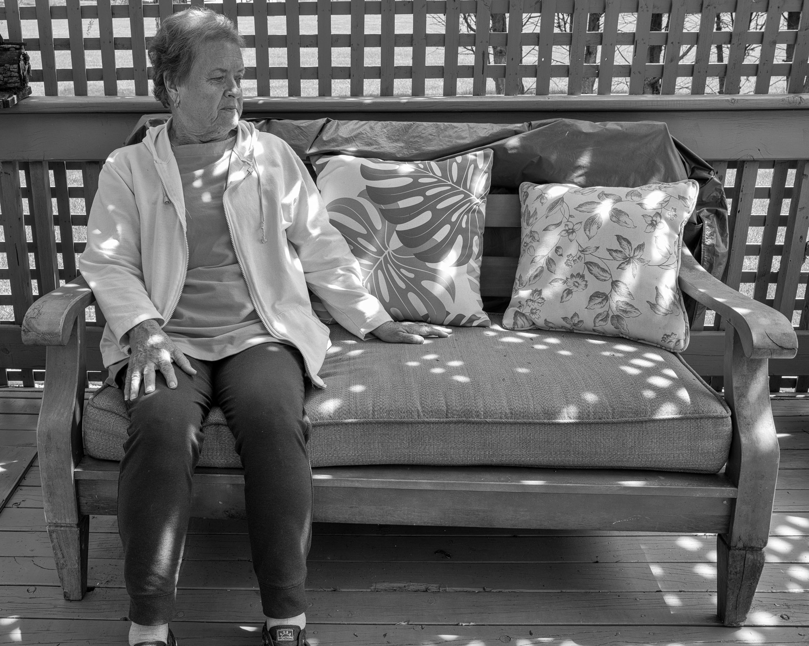
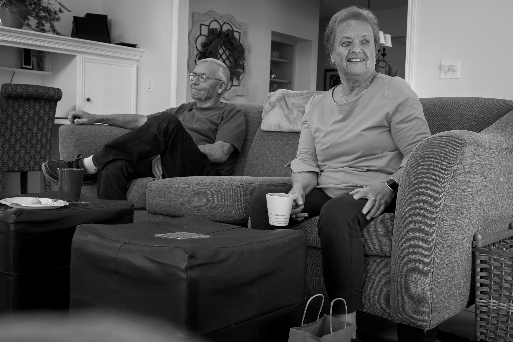
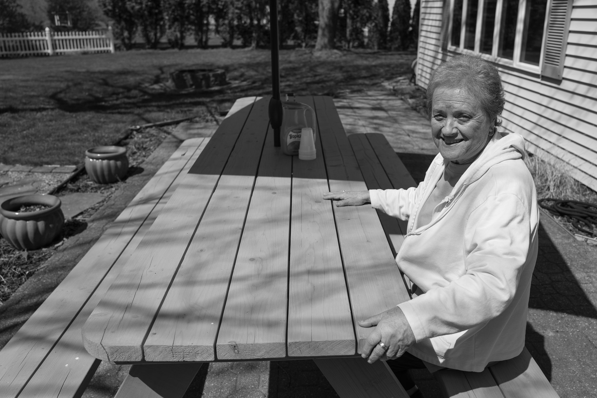
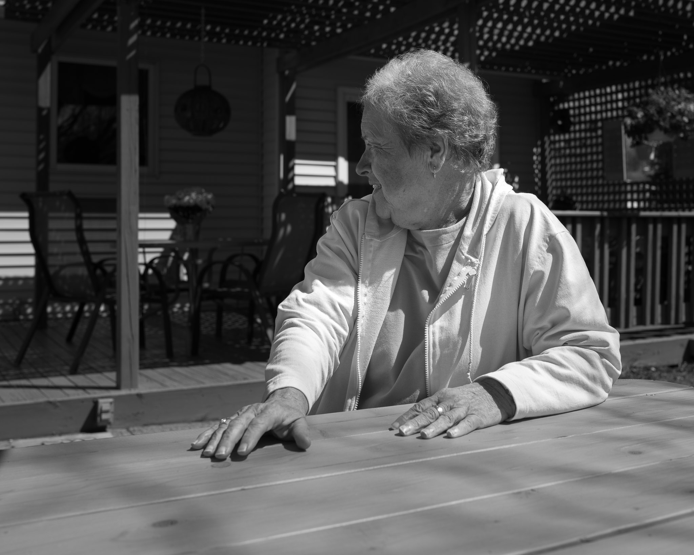
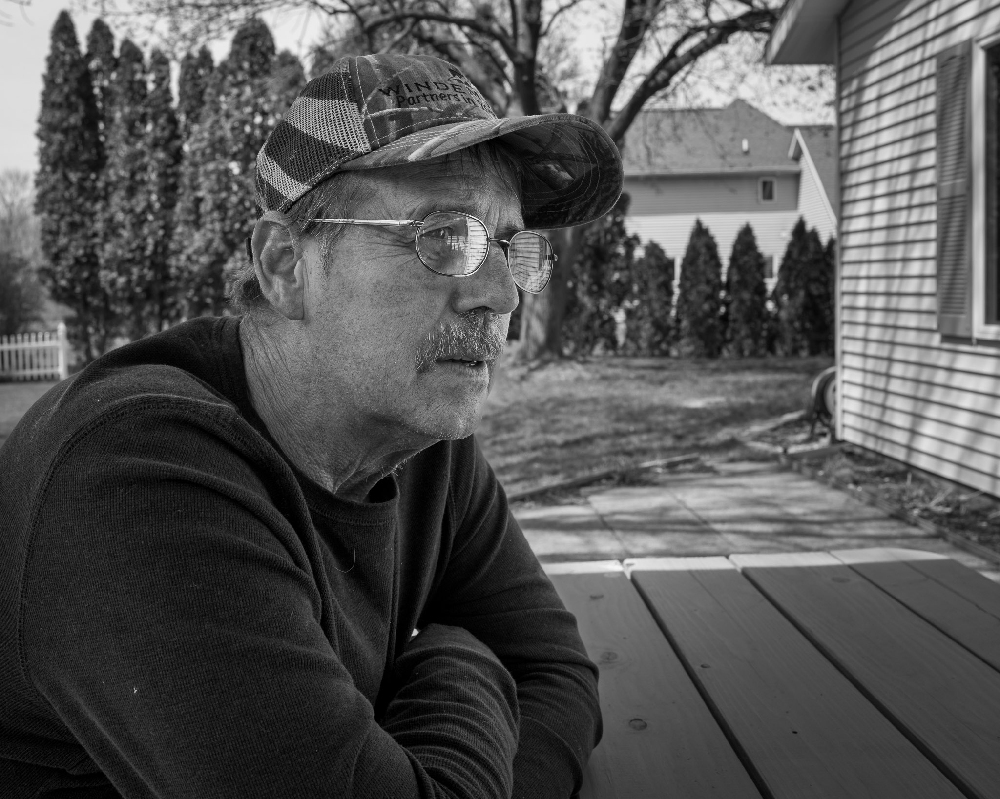
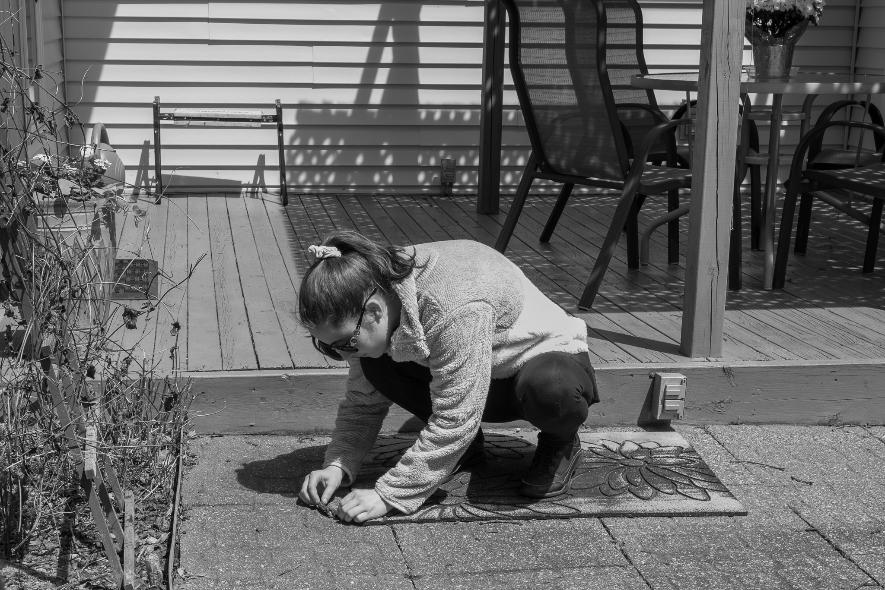
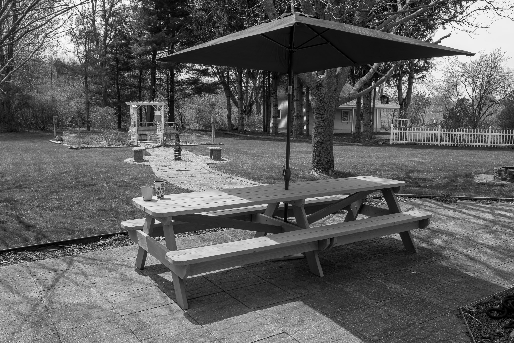

+++
title = "A few photos from Mother's Day"
date = 2022-05-09T07:40:00-04:00
lastmod = 2022-05-09T12:40:14-04:00
slug = "a-few-photos-from-mothers-day"
tags = ["Family"]
categories = ["Photography"]
draft = false
weight = 0
featuredImage = "Preview.jpg"
+++

Had brunch at my parent's yesterday to celebrate Mother's Day. It was nice. My mom has been suffering from pain in her leg for a few weeks, but the combination of new meds and time seems to have helped quite a lot. I took the Leica Q2 Monochrom and made a few snaps. Here are my favorites from the day.

[//]: # "Exported with love from a post written in Org mode"
[//]: # "- https://github.com/kaushalmodi/ox-hugo"
