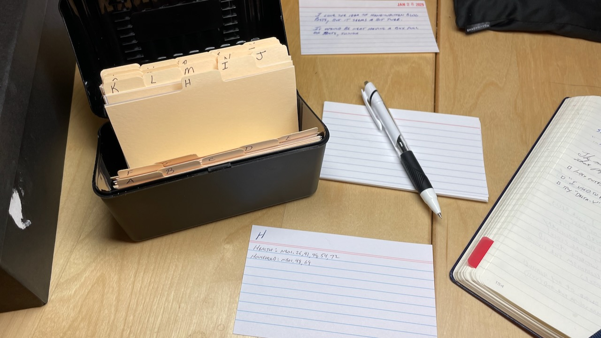

I keep a simplified version of a Bullet Journal in paper notebooks. I write in it every day. In it, I write tasks, log meals, write journal entries, copy quotes, etc. This way of working fits my brain, and I see no future in which I'm not doing some version of it.

But I must admit that y'all are right, searching paper notebooks kind of sucks. However, I'm not moving my notes to digital just so I can search them more easily. That's not a trade-off I'm interested in. Instead, I'm working on a system that makes my paper notebooks easier to search. Or perhaps it's better to say that I'm working on making it easier to find things I've written in my paper notebooks. 

A year ago I started highlighting my notebooks (see [Highlighting in Notebooks](/posts/2022/highlighting-in-notebooks)). This works great. It lets me quickly scan my notes and pick out important topics. What I'm now doing is adding those topics to an index. I already maintain a table of contents in each notebook, but that's not the same as an [index](https://en.wikipedia.org/wiki/Index_(publishing)). My index is kept in a box of 3x5" index cards (see photo).

The contents of my index differ from that of my Antinet experiment (which I'll write about later). This index is of personal notes, observations, interactions, etc. The Antinet is for topics I'm interested in. 

Have you tried keeping an index like this? If so, I'd be interested to hear how you're handling it. 

