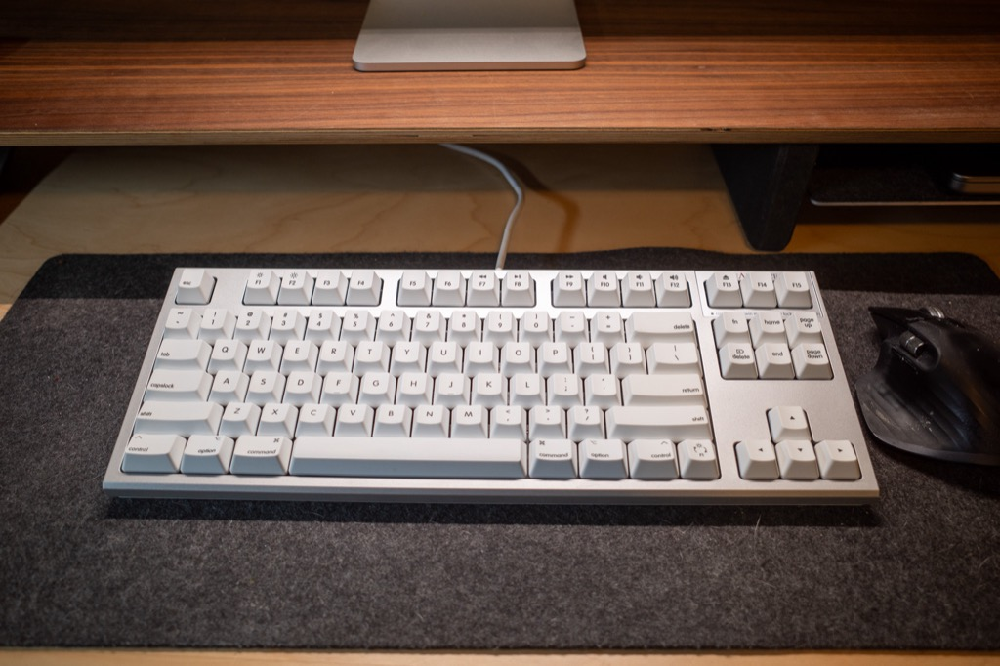

I've got HHKB pinky again so I'm switching to the Realforce keyboard for a while, even though the Escape and Delete keys are a mile away now.

## What of my wiki?

There are nearly 3,500 entries in [my wiki](https://wiki.baty.net). That's a lot of my life's information, stagnating, and it worries me. Not because there's a risk of losing it, but because it feels like I wasted a lot of time building it and now it just sits there, which is not what a wiki is supposed to do.

For a few years, the wiki was where I wrote the kinds of daily posts that I'm now writing here. Also, I'm now keeping my notes in Org or Markdown files using Denote in Emacs. The wiki is languishing.

Except here's what I've noticed. When I discover something I want to remember, I still reach for the wiki first. Related to that, when I want to look something up that I am sure I'd written down, more often than not I find it on the wiki, and quickly. For some reason, the stuff I put into Denote just sort of disappears. Sure, I can grep/find/ripgrep/ag/BBEdit the dickens out of the plain text files, but I find it to be less useful and more difficult. 

So yeah, this is unsettling.

