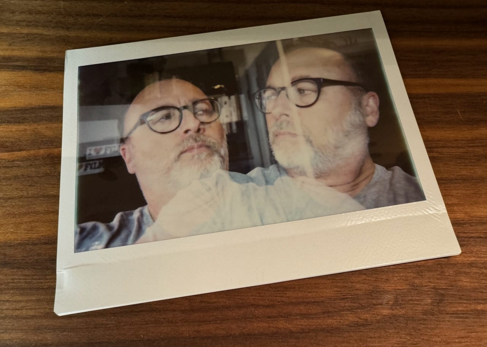

I've been having thoughts of more Linux. I've got MINT running on the little MacBook Air, but also glanced at the ThinkPad Carbon running Pop\_OS that's sitting on a shelf. It would be fun to play with, but then I remembered that the most productive move I've ever made was to stick with running one OS on one computer. Some day that may be Pop\_OS on a Thinkpad, but right now it's macOS on a MacBook Pro.

---

Related to the above, I'm convinced that [another good move](/posts/2023/2023-10-05-journal/) was to circle my publishing wagons around this single blog. It goes against my natural tendencies to explore and, let's admit it, boredom, but imagine how much energy I could save while sticking with one thing for a minute.

---

---

31 posts here have old image markup from some WordPress migration or another in the source files and they render poorly. I'm going to fix them, by hand, one at a time. Why do I change things all the time? What a hassle.
