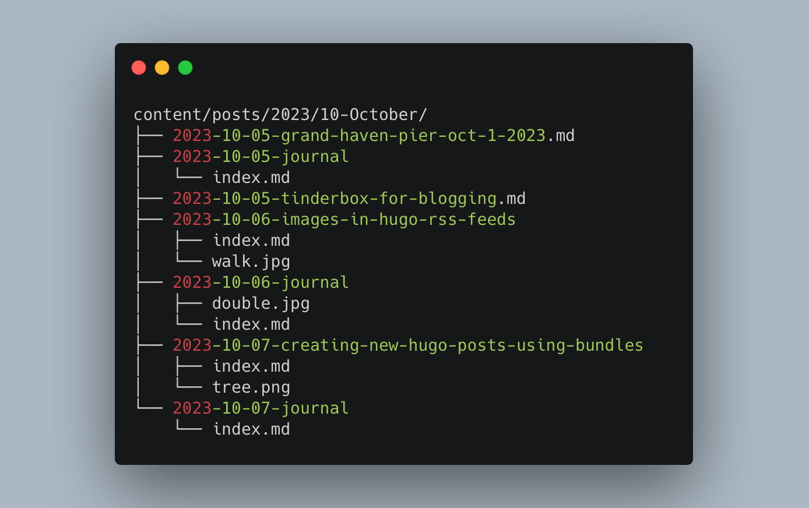

I create two disinct types of posts here: Regular posts and Journal posts. Each has its own set of metadata and different formats for filenames, so I have two similiar-but-different lisp functions for creating new posts using Emacs. This works fine.

Journal posts take advantage of Hugo's page bundle features, so they go in a bundle like so:



Regular posts, though, either go in a bundle or can be just standalone Markdown files if there are no images in the post. This means that each time I create a new post, I have to choose whether is should be in new-post.md or /new-post/index.md.

Now, I usually have no qualms about copying and pasting code when it's easier and unlikely to cause issues down the road. As Rob Pike said, "A little copying is better than a little dependency." In this case, though, it felt wrong to simply duplicate the function in order to only change the file name.

My brain doesn't get along with Lisp, but I'm using Emacs so that's what I have to work with. My solution was to add a yes-or-no prompt asking if the new post should be a Bundle, and then create the file based on the response. I fumbled around with this for at least an hour before finally finding something that worked. I have no idea if it's the best way to do this. Or even if it's a _good_ way to do it, but here it is[^tor].

```lisp
;; Create new hugo post
;; h/t Jeremy Friesen https://takeonrules.com/2021/05/20/emacs-function-to-rename-hugo-blog-post/
(defun jab/hugo-new-post (title &optional)
  "Create new blog post for TITLE."
  (interactive "sTitle: ")

  (let* ((slug (s-dashed-words title))
  (default-directory (concat "~/sites/blog/content/posts/"
        (format-time-string "%Y/%m-%B/")))
  (fpath (if (y-or-n-p "Make Bundle?")
      ;; If y create directory using slug and add index.md to path
      (progn
        (make-directory (concat default-directory (format-time-string "%Y-%m-%d-") slug "/"))
        (concat default-directory (format-time-string "%Y-%m-%d-") slug "/index.md"))
    ;; Otherwise just use the slug for the filename
    (progn
      (concat default-directory (format-time-string "%Y-%m-%d-") slug ".md")))))
    
    (write-region (concat
                   "---"
                   "\ntitle: '" title "'"
                   "\ndate: " (format-time-string "%Y-%m-%d %H:%M:%S %z")
                   "\nslug: " slug
                   "\ncategories: [\"\"]"
                   "\ntags: [\"\"]"
                   "\nsummary: "
                   "\ndraft: true"
                   "\n---\n")
                  nil (expand-file-name fpath) nil nil nil t)
    (find-file (expand-file-name fpath))))
```

[^tor]: This is all heavily based on [code written by Jeremy Friesen](https://takeonrules.com/2021/05/20/emacs-function-to-rename-hugo-blog-post/)
