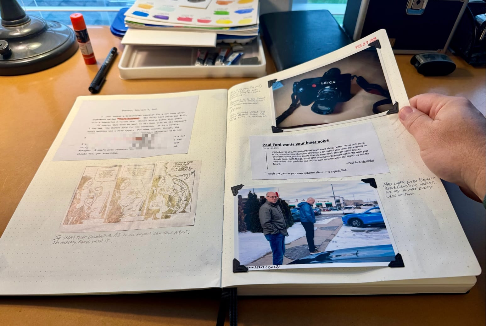

Many things I do turn out, in hindsight, to have been a complete waste of time. Journaling in my paper notebook/scrapbook is not one of them. 

I just love randomly flipping through them. I revisit these pages much more often than I do my old Day One journals or even my Org journal. I love how permanent they feel; how stable and immutable they are.

At first I tried to be precise and selective about what goes in them. The A4-size Moleskine notebooks I use cost around $25ea., so I didn't want to "waste" them. That was silly. I've found that the more random and haphazard I get, the more I enjoy them. All bets are off, cost be damned!

So, what goes in them? Anything! I mostly add photos with a caption and bit of backstory written next to them. But I also glue in ticket stubs, comics or ads cut from magazines, cut up bits of pages I've typed up on a typewriter, index cards with quotations, business cards, whatever. 

It doesn't matter if I skip a week or a month. 10 years from now it'll all be compressed into "the past" anyway. I don't beat myself up about it.

I do wish I would write more and longer actual journal entries. If I'm honest, the notebooks have become more scrapbook than journal, but I don't care. They're priceless.

