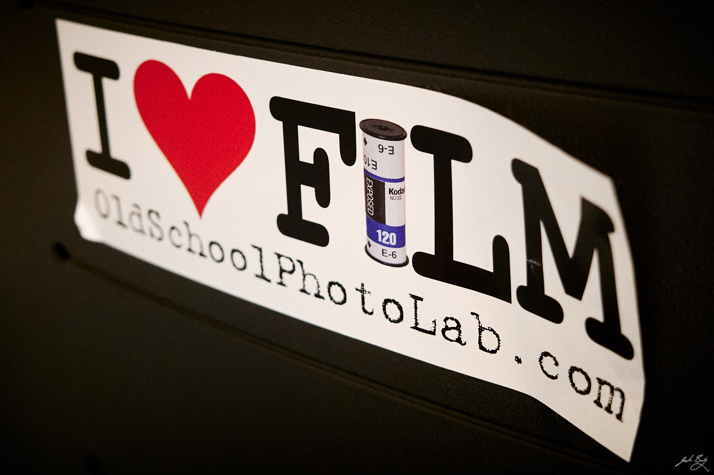

Whenever I review my recent photos, I am reminded that I prefer film. Film is fun, if sometimes frustrating, to shoot. Film cameras are cooler. And I love the results. 

This morning I was tinkering with film emulation styles in Capture One, to see if I could get something close to HP5. The presets are pretty good, but even if they completely nail the look, they're still digital photos manipulated to resemble something they're not. This bugs me.

When I go out, I bring both film and digital cameras. You know, just in case. I tell myself this will ensure that I "get the shot", whatever that means. I'm not sure it works the way I think it does. I often spend so much time deciding which camera to use and then switching that I'm sure I'm missing lots of shots anyway.

Sometimes I'm disappointed with the results from film, sure. There are development issues, dust (OMG the dust!), low light challenges, etc. Thank goodness I have a digital version, right?

Having options is great, but always having to decide...isn't, so I'm thinking about going all-in with film for a while. 

Film photography is slow, expensive, and untrustworthy. It's also fun, creative, interesting, and makes for, in my opinion, nicer images.

I have a new iPhone 15 Pro and that should cover any "must-have" documentation photos and selfies, but otherwise I will try shooting everything else with a film camera. For a while.



