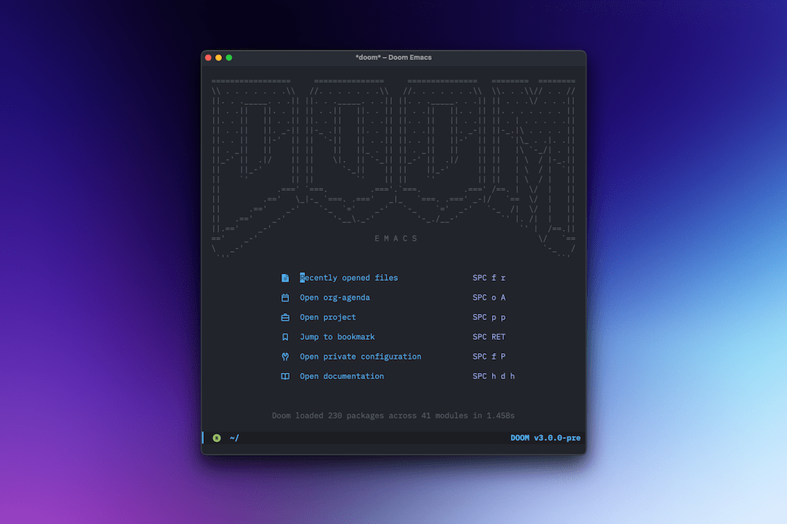

Emacs is less than friendly out of the box, so we customize things to suit our own personal tastes and preferences. When starting out, some people even enjoy that part. It's one of the best things about Emacs, but I hated it. I just wanted to *do* stuff, ya know?

I muddled through (this was in 2011), but eventually I tired of having to figure everything out on my own, so I tried a few "starter kits". That was much better! I could piggyback on someone who knew a lot more than me, then edit to suit. A few people scolded me for "cheating", but ¯\_(ツ)_/¯.

Long story short, I went through a few of these kits before landing on Spacemacs. As a long-time Vim user, using Spacemacs was awesome. But man, that weird configuration scared me. Along came [Doom Emacs](https://github.com/doomemacs/doomemacs), which claimed to prioritize speed and I found that to be true. Doom's configuration was much more reasonable, I thought, so I switched to Doom.

Since then, I've gotten the bug to roll my own config again, so I did that. Three or four times I did that. After many (many!) hours, I would eventually just end up with a shitty version of Doom anyway.

My most recent attempt at building my own config was actually pretty good. It was fast, simple, and reasonable. At first, anyway. Then I'd realize that I missed something so I'd add it. Then I'd add more  things. Just a little tweak, is all! Eventually, my startup times were getting longer and things would break that I'd forgotten how I'd made work in the first place. 

I get lazy and don't always feel like fixing things or figuring everything out on my own, so yesterday I ditched the whole thing and installed Doom from scratch. I copied over the best parts of my custom config and off I went. Doom is nicer than mine was. It's probably nice than mine would ever be, so why do I keep trying to do it myself?

