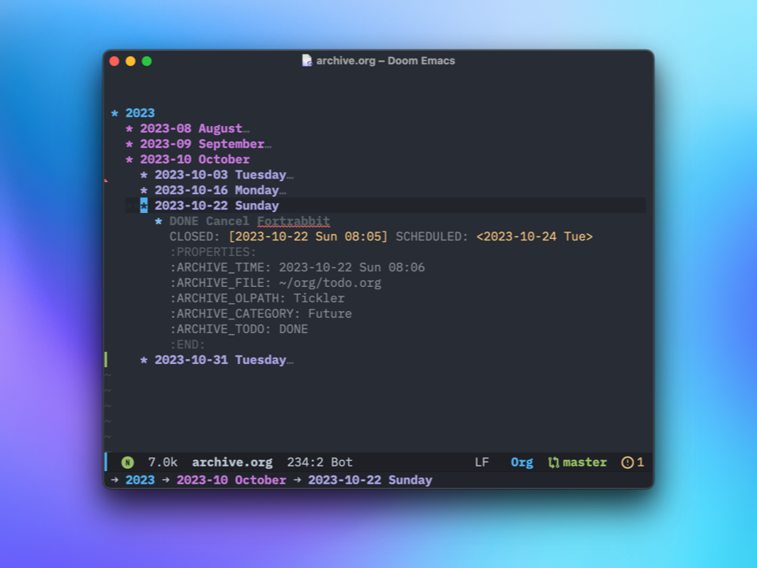

Just a quick appreciation of a common Org-mode feature. 

By default, archiving a TODO in Org-mode moves it to another file:

> "The default archive location is a file in the same directory as the current file, with the name derived by appending ‘_archive’ to the current file name."
> 
> <cite>[Moving subtrees (The Org Manual)](https://orgmode.org/manual/Moving-subtrees.html)</cite>

I never gave this much thought and sort of assumed that it was just how things worked. Of course this is Emacs, so yeah, it can work however I want it to work. 

I use TODOs in a couple of ways. First, I keep fleeting, repeating, and future TODOs in a single, giant "todo.org" file. TODOs here are normally not related to specific projects. When I'm done with them I want them out of the way, so I archive them using `org-archive-subtree`, which behaves as described above, by default. I also keep an "inbox.org" file for newly-captured TODOs and notes. This means I have two separate _archive files. I prefer to keep things together, so I started looking for a better way to handle things.

Of course there's a better way to handle things. It looks like this:

`(setq org-archive-location "~/org/archive.org::datetree/")`

Now, everything I archive goes into a single Org file, organized by date within an Org date tree[^datetree], like so:

For projects, I create a separate Org file and I keep all TODOs related to the project within that file. It's nice and tidy this way. What's not as tidy is when I archive things in project files, by default I end up with a bunch of matching _archive files. Or, using the above configuration, they end up mixed in with everything else in "archive.org"

I want project TODOs to remain in the original project file, but I also want to archive old ones, so, instead of calling `org-archive-subtree` I use `org-toggle-archive-tag`. This adds an :archive: tag to the TODO, which prevents it from showing in my agenda and excludes it from exports and sparse trees, etc. This effectively removes it from my normal routine, but the TODO remains right there in the project file. Neat!

Much of this is obvious and well-known to Emacs users, but I wanted to call it out as something that makes using Org-mode so much fun.

[^datetree]: A date tree is an outline structure with years on the highest level, months or ISO weeks as sublevels and then dates on the lowest level. I love date trees so much.

