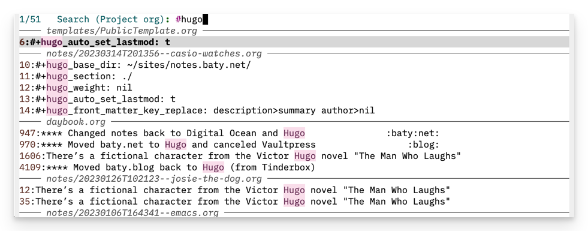

This morning, I had trouble finding something that I was certain I'd written yesterday. I was pretty sure I'd written it in one org-mode file or another, but it seemed to be missing.
Turns out it wasn't missing. I just couldn't see it because of the way the results show up when searching for something in Emacs. The display of search results when running projectile-ripgrep is pretty awful, and I missed what I was searching for. Here's what it looks like in Doom Emacs by default.

I don't know about you, but I find that difficult to scan. Here's the same search (although with different content) in Obsidian's "Omnisearch":

If I'd written my note using Obsidian, I'm convinced I would have found it straight away[^fn].
This bugged me so much that I fired up Obsidian and thought, "There, I'll just put my notes in Obsidian. Problem solved!"

Except you know what came next. I don't enjoy using Obsidian. Emacs is better at nearly everything. Once again I'd overreacted to a minor annoyance and was going to burn it all down and start over. That's a silly thing that I do. I avoided it this time, thankfully.

[^fn]: I understand that some people might feel the opposite. Not the case for me.

