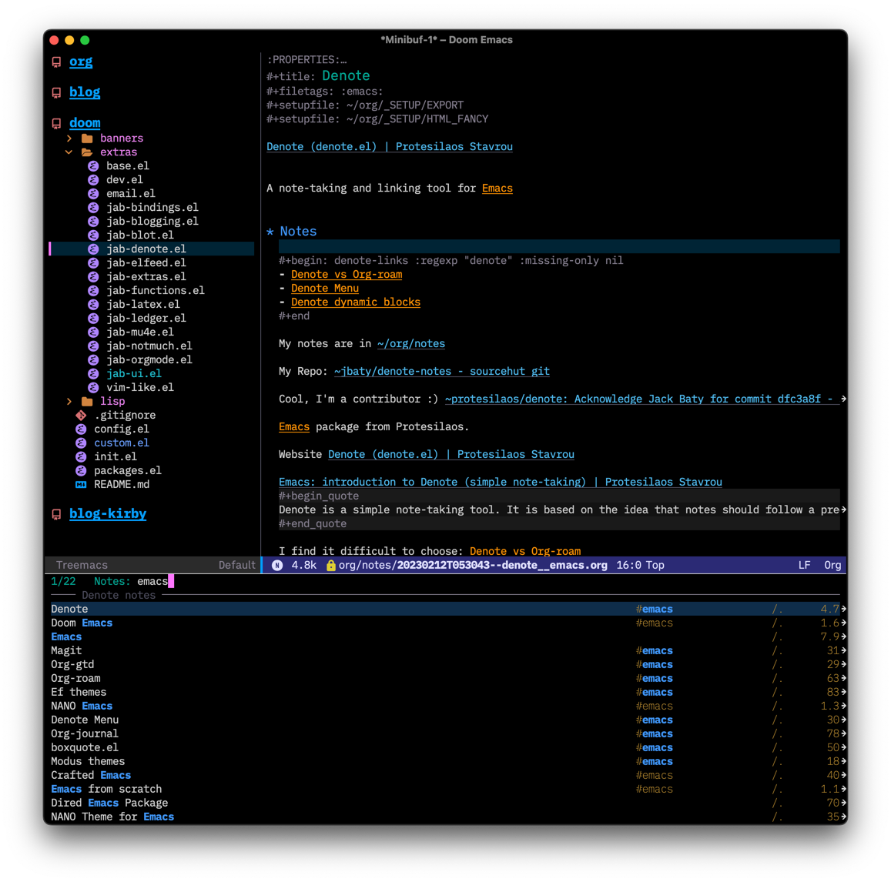
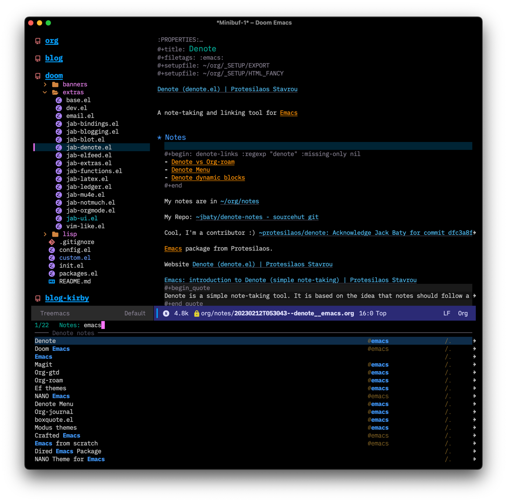

Protesilaos Stavrou updated his [spacious-padding package](https://git.sr.ht/~protesilaos/spacious-padding). I’d ignored this earlier but installed it today and it’s a nice, subtle, quality-of-life improvement to Emacs.

> It increases the padding or spacing of frames and windows on demand.
> 
> The idea with this package is to provide the means to easily toggle between terse and spacious views, depending on the user’s needs.
> 
> [Protesilaos Stavrou](https://protesilaos.com/codelog/2023-06-03-emacs-spacious-padding/)

Here’s a before and after from my config (running the ef-dark theme, also from Prot)

