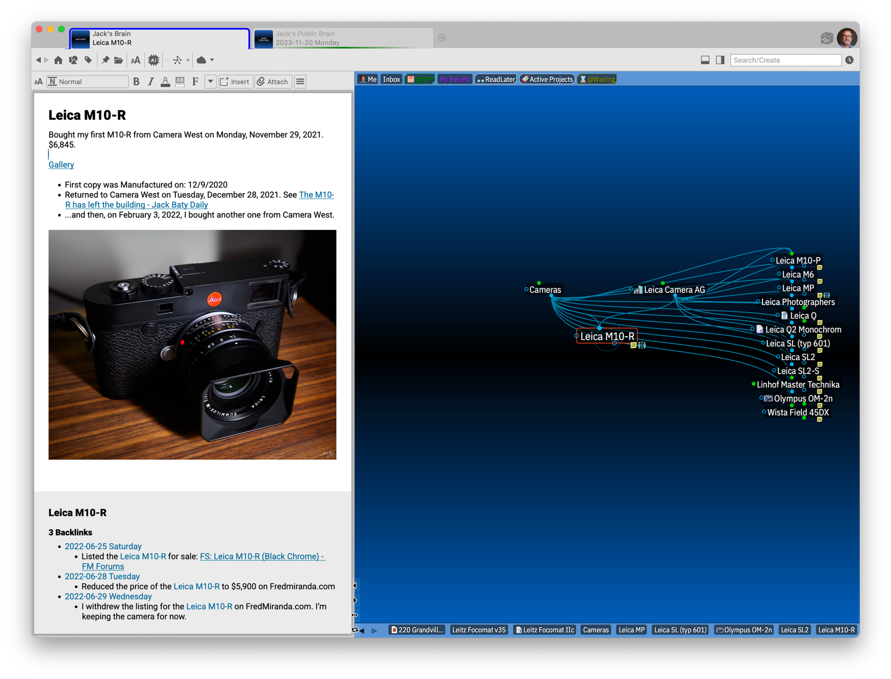

[TheBrain](https://thebrain.com/) might be the original "second brain". I mean, it's right there in the name. I started using it when it was still named "PersonalBrain", sometime before 2011.

At some point around the time [Roam Research](https://roamresearch.com/) released Roam, I stopped using TheBrain, mostly because I didn't enjoy writing notes in it and adding new thoughts felt cumbersome compared to Roam. Roam was an outliner and made quick work of adding and linking notes. This was also a heyday of Notion, Obsidian, Craft, etc. TheBrain seemed a bit dated, so I moved on for a while. Of course throughout all this, I was living in Org-mode as well.

But here's what happens: I need to look up some old note or file, and when I launch TheBrain and search, if it's in there, I find what I'm looking for immediately. Not only that, but I get a good sense of context and can jump to nearby "thoughts" quickly and continue digging until I have what I need. Every time this happens, I dive back into using TheBrain. Eventually, I get distracted by newer, shinier tools, but TheBrain never goes away completely. I made the mistake of "starting over" with an empty brain at some point in early 2016, so I lost everything before then. I won't make that mistake again.

So why do I always come back to using TheBrain?

**It handles everything**: notes, links, backlinks, files, everything. File attachments are important to me, and TheBrain handles them well. As opposed to the janky way things like Obsidian deal with files.

**I always find what I'm looking for** and can get a sense for context right away. Isn't this what taking notes is _for_?

**There are no limits** to how much I put into it. I never need to worry about things getting too large or becoming too slow. See [Jerry's Brain](https://www.jerrysbrain.com/) as an example with 500,000 thoughts.

**Each thought is just a folder** on my Mac. Notes and attachments live on the filesystem. They're buried in UUID-named folders, but I can still find stuff outside of TheBrain. One thing I've done is to index the entire brain hierarchy in [DEVONthink](https://devontechnologies.com/apps/devonthink). I don't fear lock-in.

**It's Markdown**. The notes editor in TheBrain is a nicely-implemented WYSIWYG editor for Markdown. The actual note is just a Notes.md file in the thought's folder. I can edit it using BBEdit or Emacs if I want.

**The Notes editor is pretty good**. For a long time, adding notes in TheBrain was...unpleasant. Recent releases have turned this completely around.

**There's a web and iOS versions**. My brain is synced and available via both a web client and iOS apps. I don't need to worry about getting at my notes when I'm not sitting at a computer.

Are there drawbacks? Sure. Getting things _into_ TheBrain takes some work. There is the [BrainBox extension](https://chromewebstore.google.com/detail/brainbox/ijepbhiglhdinkklggdeelopcjfnhfhd), but it's not great. (I understand they're working on a new one, though). Otherwise, getting things in is drag-and-drop or nothing. Some form of global quick-capture features would be nice. Perhaps with the newly-released API, someone will make one. And I need to _put everything somewhere_. I mean, that's kind of the point, but still. Another thing is that TheBrain is expensive and requires a subscription. I pay $159/year for the Pro edition and sync services. (That's actually cheaper than Obsidian with Sync and Publish subscriptions, but still.)

I'm a "notes first" person. I prefer to work with notes over files. But, I also manage a lot of files. TheBrain makes doing both of these things easy. It connects everything to everything. Some thoughts are nothing more than holders for other types of documents. For example, I have thoughts that are just a Tinderbox document. Others contain Org-mode files. Others contain links to Google docs. Thing is, TheBrain _connects all of these things_. It's powerful stuff.

