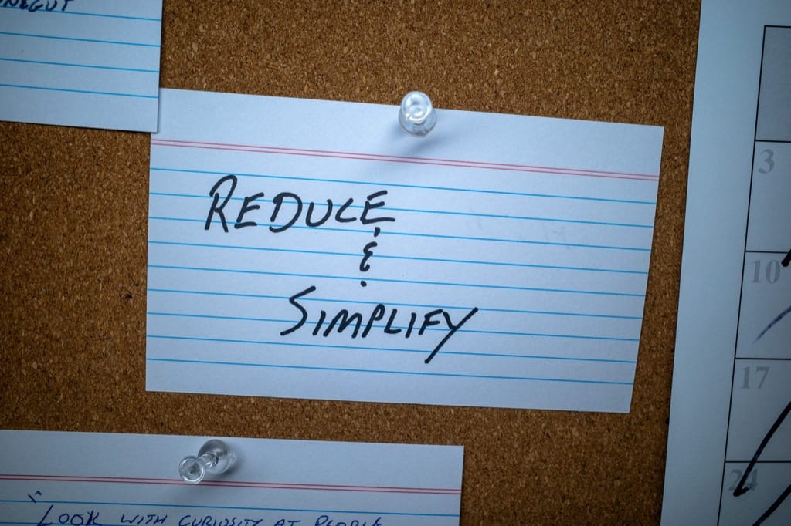

If forced to come up with a theme for 2024, I'm going with "Reduce & Simplify".

I haven't formally defined it yet, but the gist of it is to use what I already have, remove things I rarely use, and rely on fewer, simpler things.

Having many choices is great, until it's not. I crossed that threshold a while ago and it's not good for my brain.

So, one app per task. One notebook. One bag. Less software. Consolidate and remove. Those sorts of things.

The "simplify" part means I should choose the simple option. An example of this is that I'll be narrowing my eyes at anything that needs to be paired, synced, or charged. Opt for the other thing where feasible.
