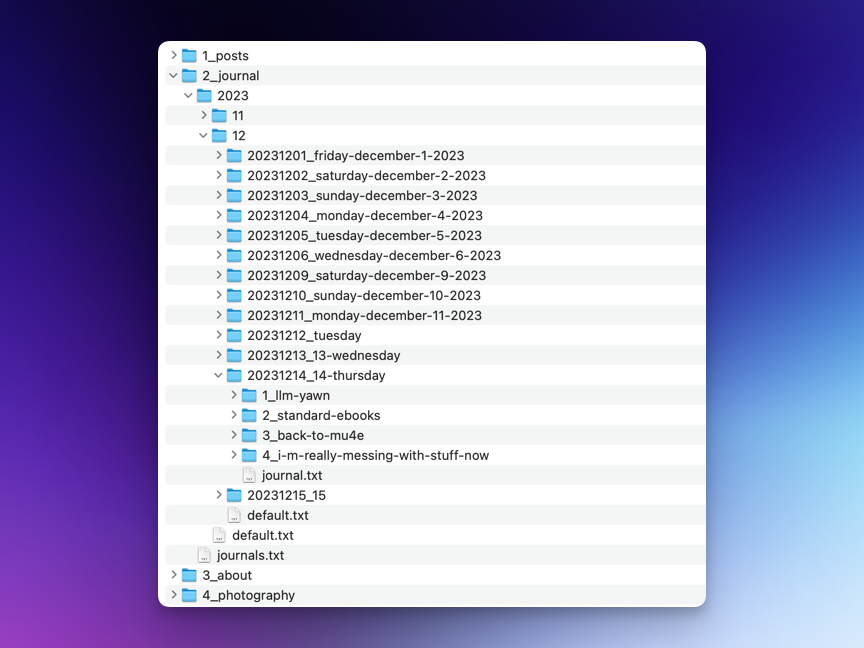
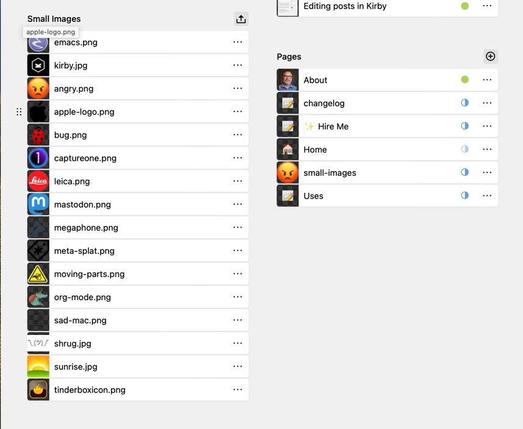
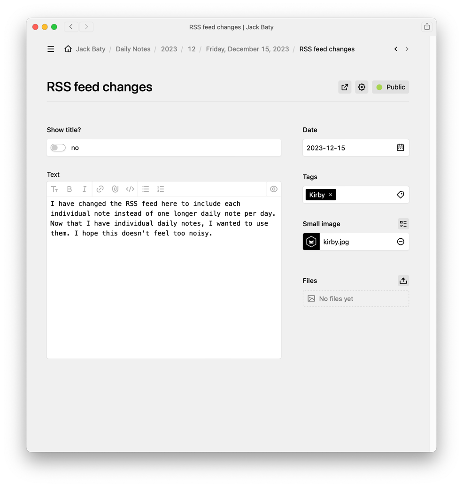

Dave Winer's [Fargo blogging tool](http://fargo.io/) worked exactly how I wanted my blog to work. It collected a bunch of individual posts into a single group for each day, with each post also linked to its own page. (Dave's site still does this at [scripting.com](http://scripting.com/)). Fargo was great, but support waned and Dave's attention went elsewhere, so I felt it was best to move on.

When I began using Tinderbox to build my [Daily Notes blog](https://daily.baty.net), I reimplemented most of my favorite features from Fargo. The big one was the daily container of notes. Another was the small icon shown on the right of individual posts. I now have both of these here at baty.net, using (link: https://getkirby.com/ text: Kirby).

Here's the (abridged version of) how I did it.

Since Kirby's static content model reflects the underlying folder structure, individual notes go right in the day's journal folder. That way, listing the notes on a day's journal page is simple as looping through `$page->children()`. 



Of course getting the notes where they belong is best done via Kirby's panel, so this meant creating Blueprints. Kirby's Blueprints are pretty cool. They're YAML files that define the UI and properties for content in the panel. As simple as they are, I am still struggling to wrap my brain around how they work. There's a *lot* of trial and error before I get things right. Eventually, my Journal Blueprint worked, and the relevant bit looks like this:

```yaml
     daily-notes:
        type: pages
        label: Notes for today
        template: note
        info: "{{ page.tags }} | Title: {{ page.ShowTitle }}"
```

And here's the panel:



Then I created a Blueprint for individual Notes.

```yaml
title: Daily Note


icon: 📝

create:
  status: listed
  template: note

columns:
  main:
    width: 2/3
    sections:
      fields:
        type: fields
        fields:
          showtitle:
            label: Show title?
            type: toggle
            text:
              - "no"
              - "yes"
          text:
            type: markdown
            size: large
  sidebar:
    width: 1/3
    sections:
      meta:
        type: fields
        fields:
          date:
            label: Date
            type: date
            default: now
          tags:
            label: Tags
            type: tags
          smallimage:
            label: Small image
            type: files
            max: 1
            multiple: false
            query: page('small-images').images
      files:
        type: files
        template: image
```

Note that the text, files and cover fields are vestigial and will be removed eventually.

The showtitle field is a toggle that determines whether to show the note's title when rendering the note. I use this for longer, multi-paragraph notes so (I think) things are easier to scan.

The "smallimage" field is fun. It's a Files field that lets me upload a small image to be floated at the right of the note's text. I don't know why, but I really like this. The trick here is that I don't want to upload the same image multiple times, so I created an area on the site.yml blueprint that allows me to upload them to a central location, then I can just pick one when adding a note.

Here's the blueprint section:

```yaml
# site.yml section
smallimages:
  label: Small Images
  type: files
  uploads:
  template: smallimage
  parent: page('small-images')
```

And here's that section on the Site Panel page:



Here's what the Note page in the panel looks like:



All that remained was to render all this in the Journal template.

```php
<ul class="note">
  <?php foreach($page->children() as $note): ?>
  <li>
    <?php snippet('note-list', ['note' => $note]) ?>
  </li>
  <?php endforeach ?>
</ul>
```

This has been an over-simplified account of the process, but hopefully you get the gist. It took me the better part of a day to get this in place, but most of that time was me fumbling around because I'm new to Kirby. Overall, it was easy and working with Kirby is darn pleasant.

I'm sure I'll tweak this incessantly as I learn more, but so far I'm happy with what I was able to put together in short order.

