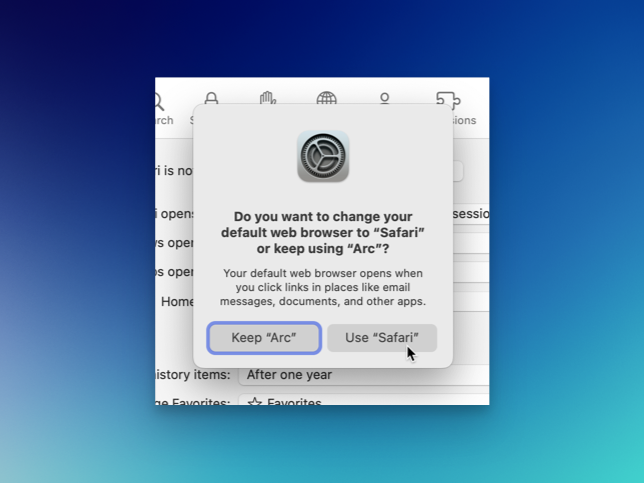

Switching from Safari to [Arc](https://arc.net) as my default browser several months ago was a big deal for me. I've always been a Safari user. Arc, though, does innovative things that I find useful (such as Little Arc and Spaces). 

Lately, however, I've noticed that I spend a lot of time "managing" things in Arc. I organize the sidebar. I pin and unpin tabs. I make spaces for no good reason. I "traffic control" sites so they open in specific ways. There are many things one can tweak Arc, and I've been tweaking all of them.

Yesterday I did this:

After using Safari all day, I remembered why I like it. It's tight, somehow, you know? It fits on macOS like nothing else does. It integrates with everything.

Arc's sidebar approach to tabs/bookmarks is awesome. What I found is that I don't like having the sidebar hidden, but when it's showing I tend to scan the list of tabs and click things at random, looking for things to do/read. This isn't Arc's fault, but still. Safari uses its UI to focus on the current page. This is better for my brain.

I'm going to keep using Safari for a spell and see how it goes. I've missed it, but it remains to be seen if I'm drawn back into Arc's orbit by all the neat stuff Arc does.

