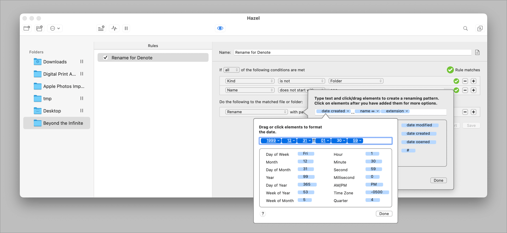
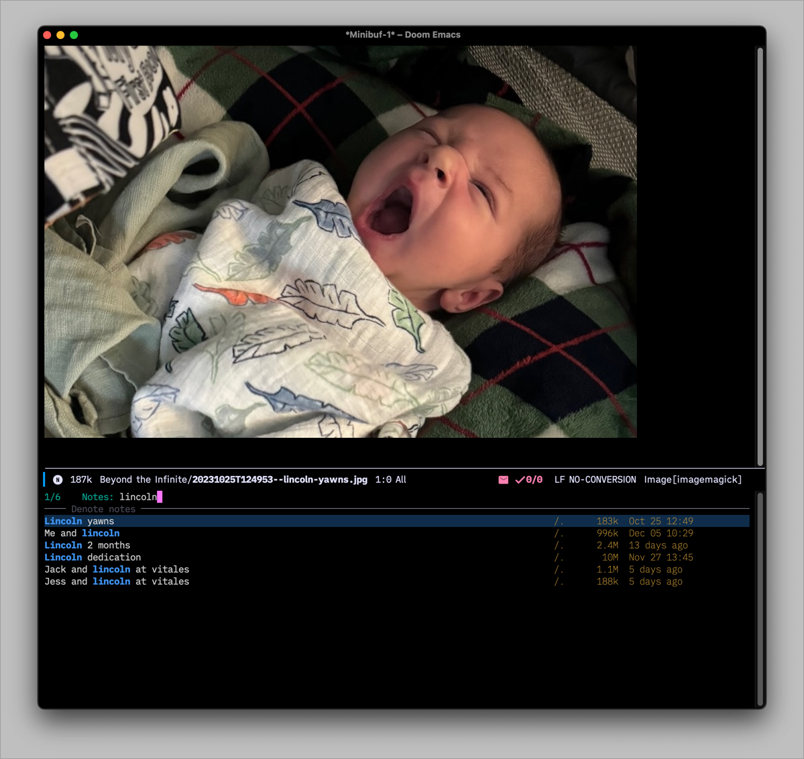

My [Beyond the Infinite folder](https://v13.baty.net/2022/beyond-the-infinite/) is now its own [Denote silo](https://protesilaos.com/emacs/denote#h:15719799-a5ff-4e9a-9f10-4ca03ef8f6c5).

A Denote "silo" is just a folder that contains a .dir-locals.el file. The .dir-locals.el file sets the `denote-directory` variable, causing Denote commands to look only in that folder (and subfolders) rather than the default Denote folder. It's like opening a separate "vault" in Obsidian, etc. 

Since I use the Beyond the Infinite folder so differently than my main set of notes, a separate silo seems appropriate.

My .dir-locals.el file is just the basics...

```lisp
;;; Directory Local Variables.

((nil . ((denote-directory . "~/Desktop/Beyond the Infinite"))))
```

To make things easier, I added a Hazel rule that watches the "Beyond the Infinite" folder and renames new files using Denote's conventions.



I haven't created any custom commands for switching between silos yet. The Beyond the Infinite folder is bookmarked in Emacs so it's already easy to get to.



Denote has become the place where I put nearly everything. I really like it.
