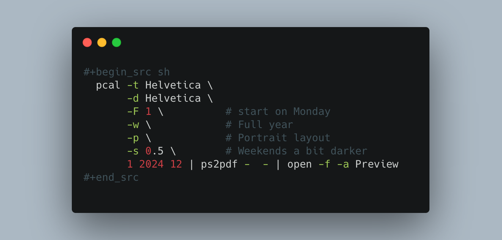
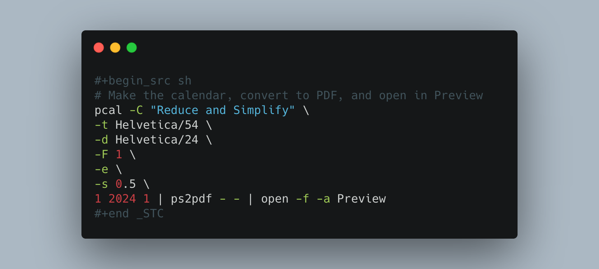

I keep printed calendars for the current year and month pinned above my desk. It's often easier to just glance up to see dates than to open a calendar on the computer/phone.

I used to use [timeanddate.com](https://timeanddate.com) and that works great, but I'm now using [pcal](https://pcal.sourceforge.net/) because it's...nerdier I guess?

Here's the shell script for the yearly calendar (I just execute it within Emacs). It runs pcal with some options, then converts the postscript to PDF, then opens in it Preview.

And here's the one for only the month of January.

I like that I can include a little note in the footer (e.g. "Reduce and Simplify").

The output for the monthly PDF looks like this:



