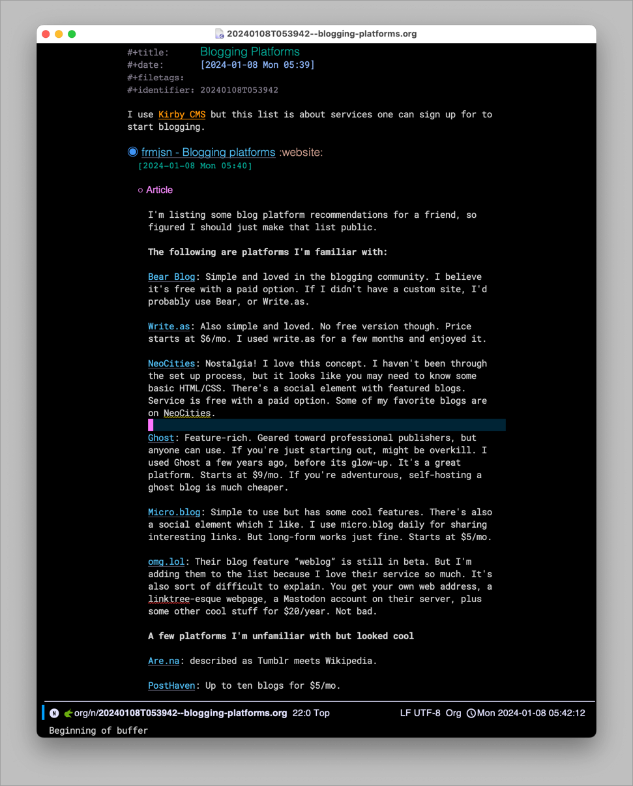



I just wanted to give a shout-out to Adam Porter for his [Org-web-tools](https://github.com/alphapapa/org-web-tools) Emacs package.

I only discovered his package a month or so ago and I've used it daily since. Put a URL in the clipboard, then in an Org-document run `M-x org-web-tools-insert-web-page-as-entry` and bam!, the page is converted into Org's format and inserted as a heading in the current file. For example, here's Jason Velazquez's post about [Blogging Platforms](https://micro.fromjason.xyz/2024/01/06/blogging-platforms.html), all tucked away nicely in my "Blogging Platforms" Denote note...

I ran the above function, and org-web-tools grabbed the page, formatted everything, and inserted a link as a heading, the date, and the meat of the article nestled under the "Article" subheading.

Nice!

There are a number of other helpful functions in the same vein. If you frequently save links or other web content in Org-mode, it's worth checking out.
