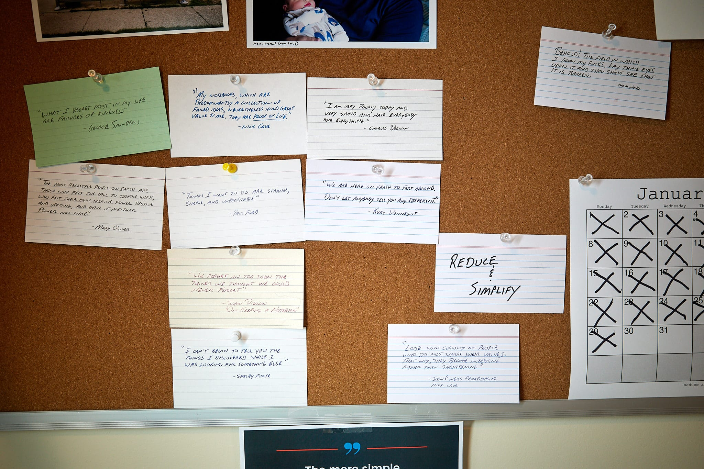

I'm really into paper-based tools lately. This is often a reaction to over-thinking my (digital) note-taking process. And oh my have I been over-thinking that process lately.

Using paper is more work, but it's worth it. Here are a few random thoughts I've had about it recently.

Paper's immutability is something you'd think one would put into the "Cons" column, but I find it to be its greatest feature. I'm fickle and uncertain and my digital notes suffer because of it. When I write something in a (paper) notebook, there it is, forever. I can scribble it out or copy it onto later pages, but I can't change my mind and *move* it somewhere else based on whatever "system" I decide upon that day. It'll always be right in that spot, in that notebook. I love this.

I love jotting quotes and observations onto index cards. I leave these cards lying about or pinned to my bulletin board. They remain visible at all times and that means they are actually seen. Too often, when I take a digital note of some kind it ends up buried in a folder or app and never seen again. I understand that it doesn't *have* to be this way, but for me, it is.

Have you ever tried flipping through pages on a Kindle? No? Right, because you can't. Or at least it's not worth the effort. I'm forgetful, and being able to quickly thumb back and answer things like, "Wait, who's kid is that again?" is necessary for me to enjoy reading books.

I keep paper journals/scrapbooks in large Moleskine notebooks. I print photos and glue or tape them onto pages then I write on and around them. I doodle in them. Doing this on an iPad with Pencil is cool, but unsatisfying. I like imperfections. I like not being able to Command-Z my way out of everything. I like pulling old ones off the self and flipping through them.

Anyway, digital tools are great and all, but I often prefer paper.

