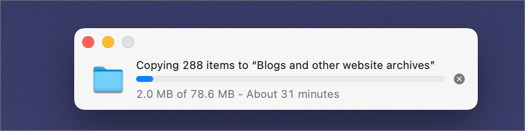
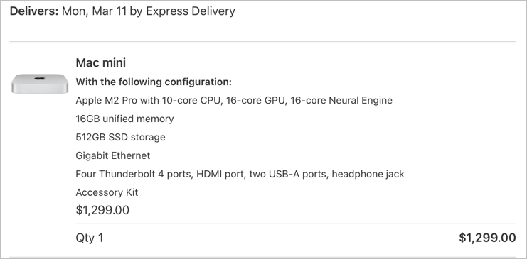

This morning it took over 30 minutes to copy a 70MB file from my MBP to the Synology over WiFi. The wait resurfaced my thoughts about having an always-on computer on my desk with some fast, attached storage.

I just ordered an M2 Mac Mini (Pro) with 16GB RAM and a 512GB internal drive.

Since 2021, I’ve had an over-spec’ed MacBook Pro (M1 Max) with a 2TB internal drive and 32GB of RAM. I don’t do much that requires all of that oomph, but I figured it was nice to have anyway. With the Mini, I went with the Pro version mostly for the additional ports. A smaller, 512GB internal drive should be fine, since I’ll have a number of fast SSDs always attached. I’m not worried about not having enough room for my stuff. The thing I’m most worried about is “only” 16GB RAM. I’ve had 32GB for so long that I don’t remember what it was like working with less. I’m almost certain that 16GB will be plenty for my purposes, but it still makes me a little twitchy. Plus, $1,299 still feels like relatively cheap compared to the $3k+ I spent on the MBP.

The hardest part of all this will be that, since I’m keeping the MBP for mobile use, I’ll now have two Macs again. Consolidating to one machine a few years ago was such a breath of fresh air. I no longer had to worry about keeping configs updates or which folders needed syncing, etc. Now it’s all back.

Keeping things synced means worrying about which apps I use, or don’t, and if they sync by default or need to be set up to do so. My org files are all in ~/Documents/org now so iCloud should take care of that[^icloud]. However, my emacs _configuration_ is in ~/.config/emacs. I’ll once again have to manage my .config files, which has always kind of sucked. I really don’t want to symlink everything and I _really_ don’t want to go back to finding some “clever” method of managing them. The answer, I think, is to use fewer things that need configuring. Good luck with that, Jack.

The next step will be to figure out my storage options. I’m thinking I’d like some sort of Thunderbolt RAID thing with some SSDs inside. And also my existing backup drives. Oh, and Time Machine, for good measure. If you’ve found something you like, I’d love to hear about it.

[^icloud]: I’ve experience few issues with iCloud, so this doesn’t worry me 🤞

