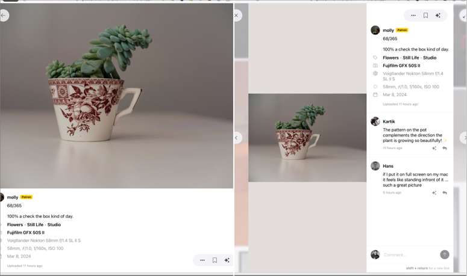
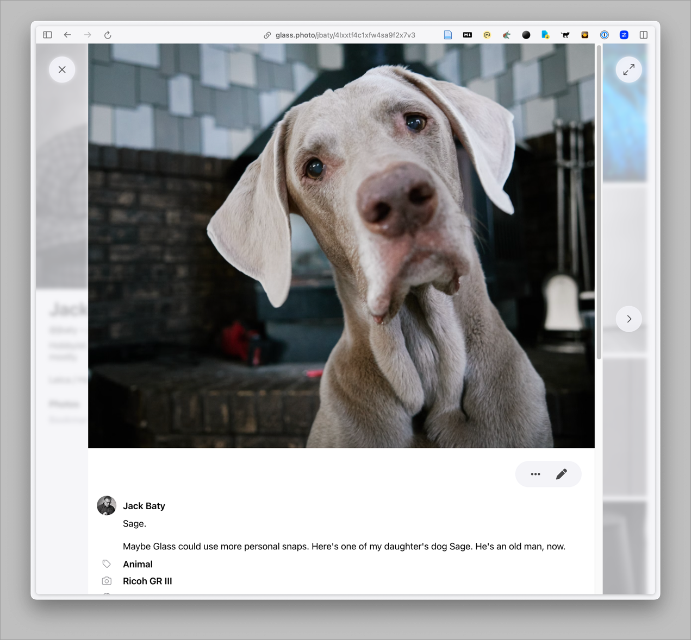

I don’t like the way [Glass](https://glass.photo/) shows images in a desktop browser when the browser window is wider than around 1,000 pixels. I prefer the layout in narrower windows, but I never have mine that narrow. This means whenever I’m browsing Glass, I have to shrink the window.



The Arc browser has “[Boosts](https://arc.net/boosts)” that let me easily adjust the CSS of any website, so I created one for Arc. This is it:

```css
.lg\:flex-row{flex-direction: column !important;}
```

Here’s the result:




This will do for now. I’ve written the Glass folks asking if there is a reason for the side-by-side default layout because I’d like to never see that layout.

