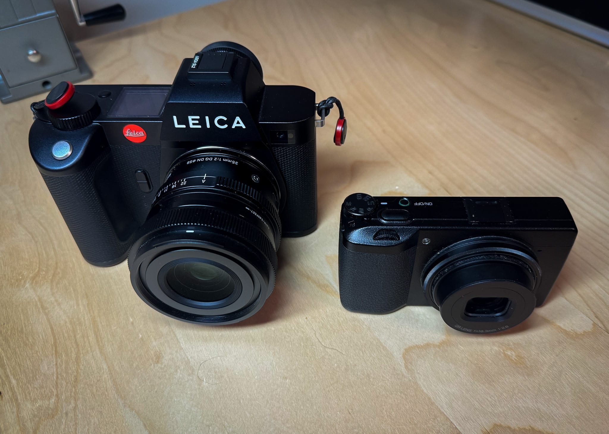

I tried, albeit half-heartedly, for 18 months to grab a Fujifilm X100V at a "normal" price. The X100 series are awesome cameras. I still have an original X100, and had an X100T for a while. The original X100 is just so very slow that I don't often grab it. When the new X100VI was announced, knowing they'd probably be in short supply soon, I pre-ordered one at both Adorama and B&H.

After missing out on the first batch of cameras, it was clear that I was in for a long wait. This gave me time to think about cameras.

I don't need a new digital camera right now. I'm barely using the ones I have, which are two very nice cameras. See for yourself...

The little GRIII is great for carrying everywhere and I love the files I get from it.

The SL2 is for when I'm being "serious" about photographing something.

Where would the X100VI fit? I suppose it would probably replace the GRIII, but the more I though about it, the clearer it became that I didn't need it, so I canceled my orders.

I would love the built-in flash, optical viewfinder, and 35mm FoV, but until I start actually making photos again, I don't need a new digital camera.

