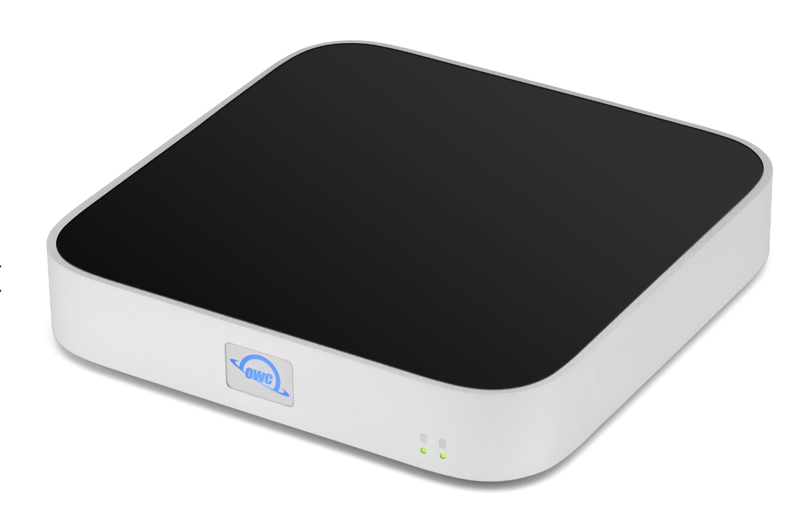
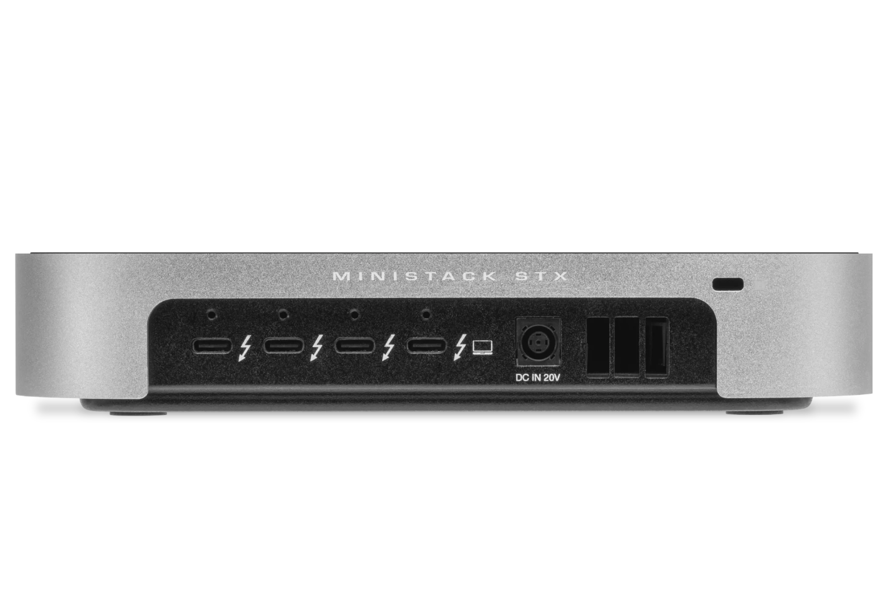
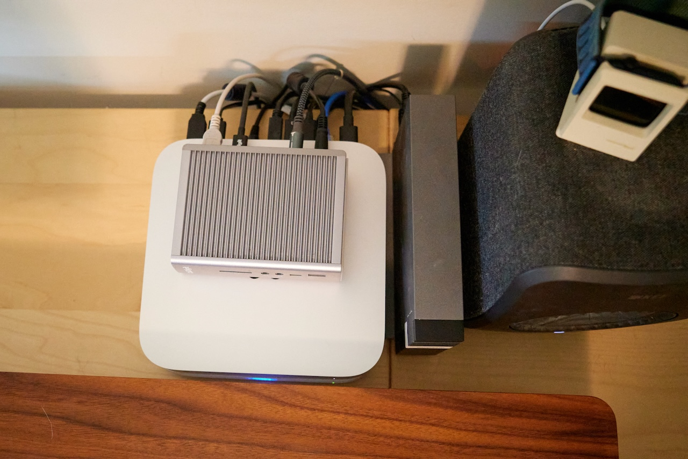
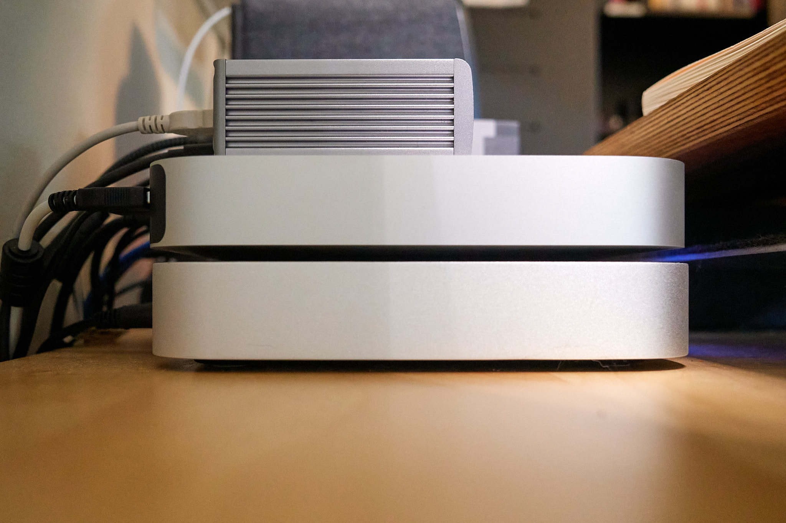
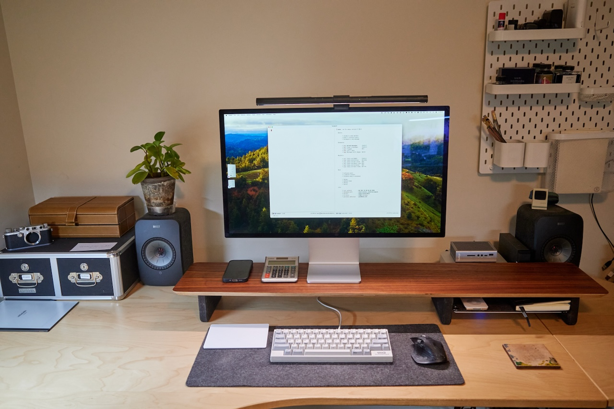

When I ordered the M2 Mac Mini I opted for the smaller 512GB internal SSD knowing that, since the Mini would be always-on, I could hang as much storage off it as I wanted.

A hodgepodge of external drives scattered over my desk is not the prettiest setup, though. I wanted something cleaner. Something nicer-looking. I went with an [OWC miniStack STX](https://www.owc.com/solutions/ministack-stx).

The miniStack can be ordered pre-configured with a variety of storage options, but I figured I'd save a few bucks and set it up myself. I ordered a 2TB Gen 4 M.2 NVMe stick and a Seagate IronWolf 8TB HD. It took about 10 minutes to install both drives into the miniStack and I was ready to go.

The whole point of the thing is that it is the exact dimensions of a Mac Mini. It sits underneath the Mini and so takes up zero additional desk space. This is way better than normal external drives.

An important bonus with the miniStack is that it adds three Thunderbolt 4 ports (actually four ports, but one is used by the Mini->miniStack cable). 

There's a small catch. The PCI bus only uses one channel so top transfer speeds are limited to around 750MB/s. I don't know anything about NVMe drives or PCIe buses so I'm just taking their word for it, but my disk speed test showed around 790MB/s. That's plenty for my purposes.

I still need the CalDigit hub for the SD slot, Optical audio, and extra USB-A ports. Here's what the stack looks like:

Setting all this up gave me an opportunity to tidy up the rest of my desk. I think it looks great.

So far I've not heard any noticeable fan noise, so that's good. I do hear the HDD grinding away but that's probably due to both Spotlight and BackBlaze doing their things.

The 2TB SSD will be used for working files and recent photos. The big HDD will contain the rest of my media and photo archives, along with anything else I want near-to-hand but don't need fast-transfer access to. That leaves a 1TB SSD (not shown) hanging off the back for Time Machine and the vertical 8TB HDD for nightly backups using Carbon Copy Cloner.

It's a nice upgrade.

