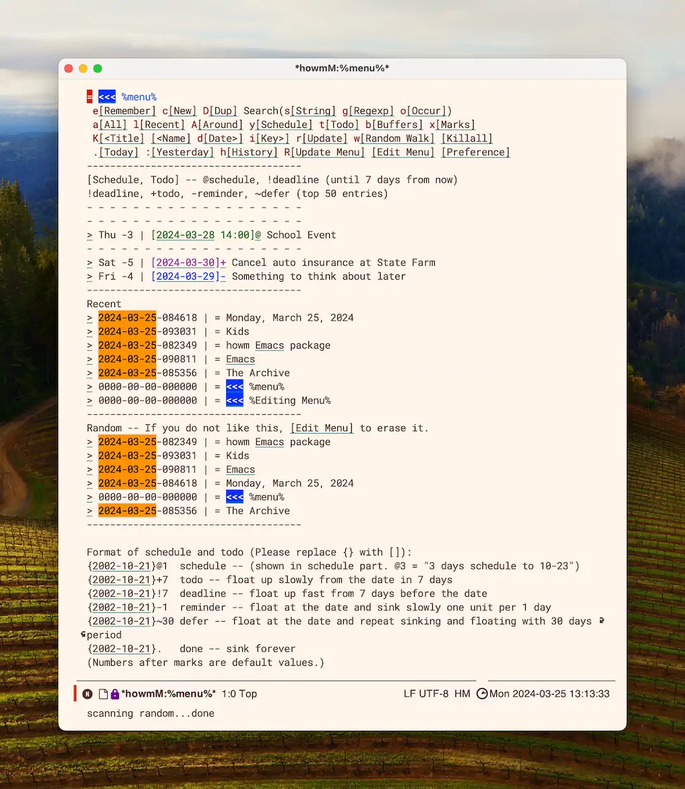
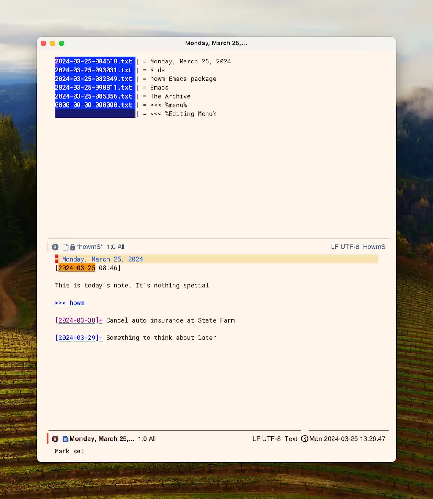

[howm](https://github.com/kaorahi/howm) is an Emacs package for taking notes. It was recommended to me recently, so I thought I'd take a look. The project page says "howm: Write fragmentarily and read collectively." Worth a shot, right?

I haven't seen too many people talking about howm. The best introductions I've found are from [Leah Neukirchen](https://leahneukirchen.org/blog/archive/2022/03/note-taking-in-emacs-with-howm.html) and [Andrei Sukhovskii](https://github.com/Emacs101/howm-manual/blob/main/Eng.md).

I installed it via use-package with the following

```lisp
;; howm package config

(use-package howm :ensure t
  :config
  (setq howm-directory "~/Documents/howm/")
  (setq howm-home-directory "~/Documents/howm/")
  (setq howm-keyword-file (expand-file-name ".howm-keys" howm-home-directory))
  (setq howm-history-file (expand-file-name ".howm-history" howm-home-directory))
  (setq howm-view-use-grep t))
;;  (setq howm-view-grep-command "/opt/homebrew/bin/rg"))

;; Fix for help bindings
(define-key howm-menu-mode-map "\C-h" nil)
(define-key riffle-summary-mode-map "\C-h" nil)
(define-key howm-view-contents-mode-map "\C-h" nil)

;; Sensible buffer names
(add-hook 'howm-mode-hook 'howm-mode-set-buffer-name)
(add-hook 'after-save-hook 'howm-mode-set-buffer-name)

```

I couldn't get the `rg` settings to work, so I'm still using grep. It's fast enough for this test. 

If you're interested in getting started with howm, you should read the articles linked above. Here's what I found interesting.

- **Major mode doesn't matter**. Howm works with everything from plain text files to Org-mode.
- **It's date-centric**. Most actions prioritize temporal nearness and files are named with just a date string.
- **There are some clever built-in todo/scheduling features.** Just put in dates like [2024-03-25]+ and howm figures out how and when to show it.
- **Linking and backlinking are simple**. Put `>>> some phrase` anywhere and it turns into a link which searches for that phrase when clicked. Put `<<< term` in a note and every other occurrance of that term will be underlined and linked to that note.
- **howm hates evil-mode**. If I were to try getting anywhere with howm, I'd need to figure out my own collection of custom bindings in evil-mode because by default they don't get along at all.

I created a handful of test files, and here's how howm looks so far.



And here it is browsing some notes.



Howm is neat, but I don't expect to move my notes into it just yet. I find [Denote](https://protesilaos.com/emacs/denote) to be nearly perfect for note taking, so I'm all set. I do think a combination of howm in plain text files and Hyperbole to add some juice would be a nice combination.


