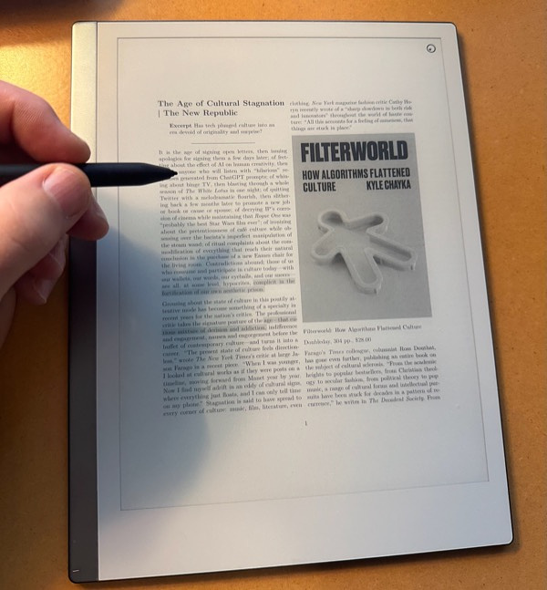
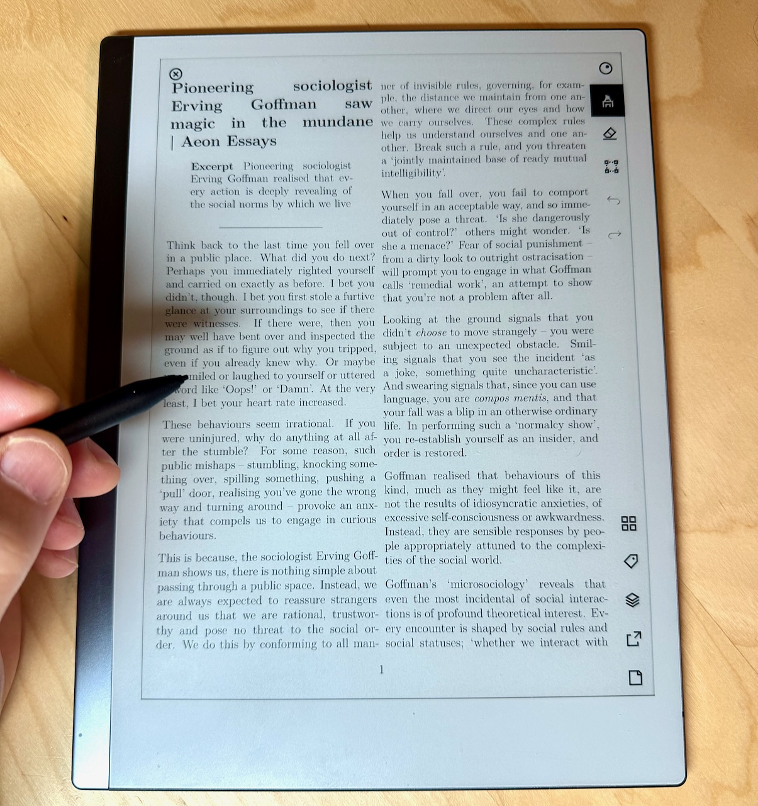

I know, I know, the [reMarkable 2 tablet][1] is designed as a digital replacement for writing on paper. It's not necessarily meant as a document reader. But that's what I've been using it for.

For years now I've saved web articles as Markdown files, converted them to PDF, and printed them for reading later. See [My read-later service is made of paper][2].

I wanted to see how reading PDFs felt on the reMarkable, so I copied a few of my saved article PDFs to it. It turns out that I liked it very much. Highlighting text with the stylus works great, and I can even choose the color of the highlights, which don't display on the device, but they do on the actual PDF.

My only complaint was that the text was too small. To fix this, I made a new [Pandoc][3] template so that the font was larger, and the margins were smaller. I included some extra room on the right, so that the reMarkable toolbar doesn't cover the text. The script outputs the PDF directly to the Dropbox folder I have synced with the tablet. Here's how it looks with the updated template.

Nice, eh?   
  
I create these by converting articles to Markdown using the [Markdownload plugin][4]. From there, I open the file in BBEdit and run a shell script which runs Pandoc to generate the PDF. Both the script and Pandoc template [can be found here][5] if you're interested. Note that they would need to be tweaked for your environment. This can easily be done via command line or just a shell script, but I've had it configured via BBEdit for so long that it's habit.

[1]: https://remarkable.com/
[2]: https://baty.blog/2023/03/my-read-later-service-is-made-of-paper
[3]: https://pandoc.org/
[4]: https://chromewebstore.google.com/detail/markdownload-markdown-web/pcmpcfapbekmbjjkdalcgopdkipoggdi?hl=en-US
[5]: https://gist.github.com/jackbaty/da7ed94312f5033a22f81d6c54b2f542

