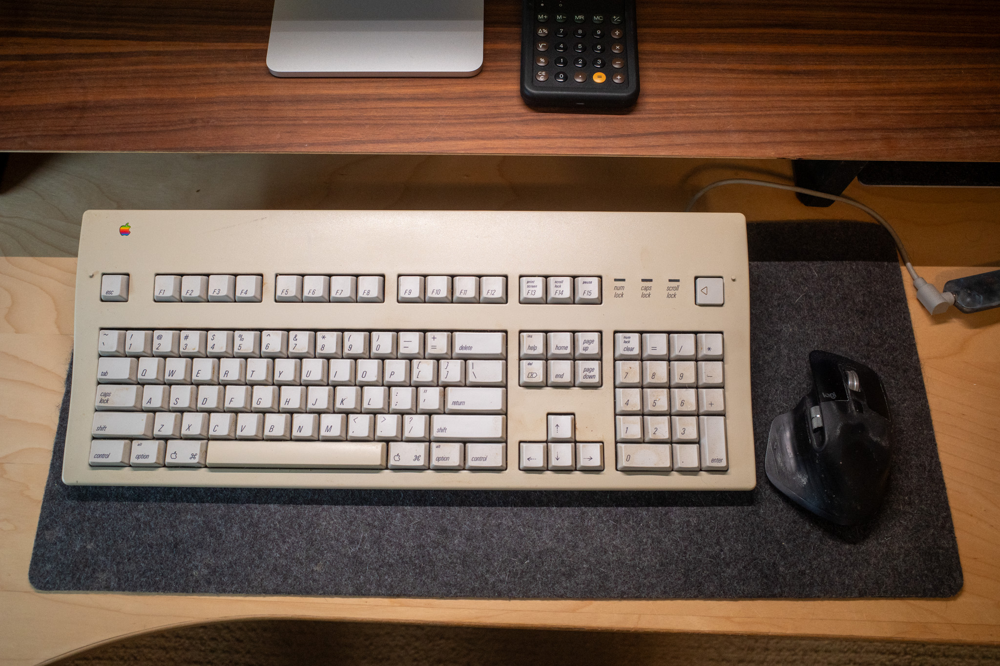

Look what I found in the garage:

It's my old [Apple Extended Keyboard II](http://en.wikipedia.org/wiki/Apple_Extended_Keyboard) from 1990 or 91. I last used this one [in 2015](https://archive.baty.net/2015/apple-extended-keyboard-ii/). 

The AEKII uses an ADB port, so I had to dig out my ADB->USB-A adapter (save everything!). I'm typing this post on the keyboard right now. The Alps switches are as great as I remember, and might be my all-time favorite switches. 

Beyond the great switches and nostalgia, using the keyboard leaves a bit to be desired. First off, it's enormous. It takes nearly all of my felt deskpad and leaves barely enough room for a mouse. And speaking of the mouse, the size of the keyboard means that the mouse is over 12 inches away from my right hand. Reaching for it is a whole thing.

Another quirk is that the little home row nubbins are on the D and K keys. On newer Apple keyboards, they are on the F and J keys. I can't tell you how many times I've had to delete a bunch of gibberish and reorient my hands while typing this.

I could get used to the size, but the AEKII's Caps Lock key can't be mapped to Control because it physically locks down when pressed. It thinks it's a manual typewriter, I guess. This is a deal-breaker.

Even though it'll probably end up back in the box soon, it's fun using a 34-year-old keyboard that still works and is, in many ways, better than anything made today.

