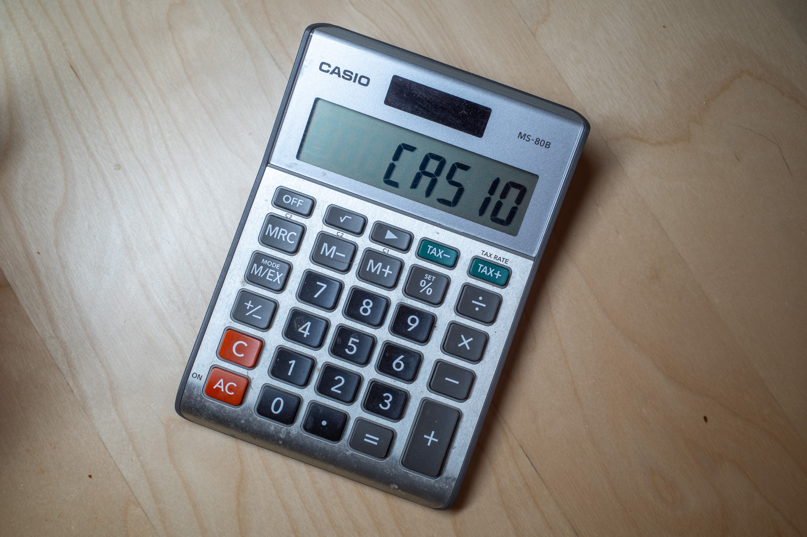
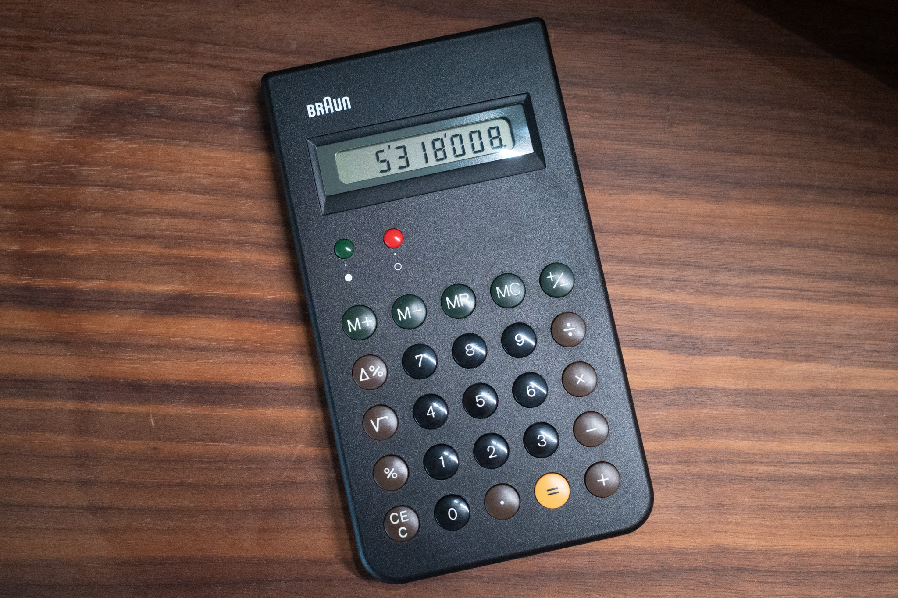

I still keep an actual calculator on my desk, and use it regularly. I find it easier and more "stable" than using either a calculator app or even the built-in calculator in Raycast.

I bought the Casio shown above years ago because it had a large screen and doesn't use batteries. It's fine, but there are a couple of things about it that bother me.

First, there's no "On" button. Ok, there is, but it's buried under the AC button. Bugs me.

The On button issue is bad enough, but that's not why I hate the Casio. I hate the Casio because when I turn it off, the screen reads "CASIO" for a few seconds before actually turning off. It's like watching a little ad each time. I hate it, so I bought a new calculator. 

This is the re-issued version of the iconic, Dieter Rams designed [Braun ET66](https://collections.vam.ac.uk/item/O1360553/et66-calculator-et66-calculator-dieter-rams/) (1987). I recently watched the Dieter Rams documentary, ["Rams" (2018)](https://www.imdb.com/title/tt8423080/), which reminded me of the Braun, so I thought this model would be a fine choice.

I like it. It's simple, clear, does what I need, and looks good doing it. And it doesn't shout its own name every time I turn it off. Much better.

