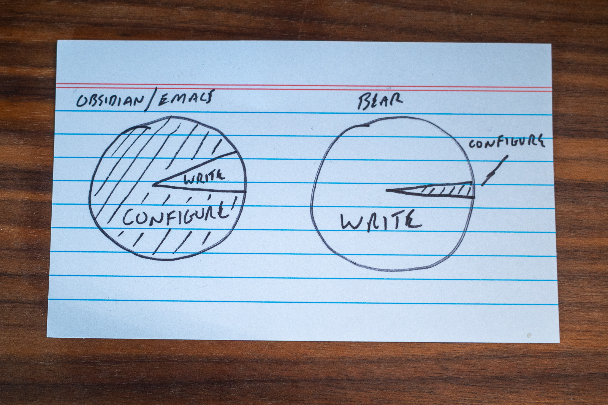

[Bear](https://bear.app) is one of those apps that either clicks with you or it doesn't. Unless you're me, for whom sometimes it clicks and sometimes doesn't.

I'm trying to follow through on my promise to [Reduce & Simplify](https://baty.net/journal/2023/12/31/reduce-and-simplify) this year, so for the past week, Bear has been clicking for me.

I first used Bear [in 2016](https://archive.baty.net/2016/bear-is-a-very-nice-notetaking-app/) and have dipped into and out of it ever since. The reason for leaving Bear has always been that it's "too simple". The reason I end up back in Bear is because it's "so simple". You see how it is?

For the past few years all of my note taking and most of my writing has been done in Org-mode files using Emacs. What an amazing combination that is. I have many custom functions and configurations that help make using Emacs fast and efficient. I can't even tell you how much time I've spent configuring Emacs exactly to my liking. And that's the problem. Nearly every time I use Emacs, I end up digging into my giant init.el file to make "just one little change". Then suddenly it's two hours later and I'm reading Reddit posts about how someone somewhere did something similar. It's fun, but it's becoming less important to me.

All of the above also applies to Obsidian. The only difference is that it's quicker to get rolling in Obsidian. But also, the influencer-driven community around Obsidian makes finding useful information even more difficult. Why am I wasting time looking for a "better" plugin right now, anyway?

With Bear, there's not much to do other than write. Sure, it can be tempting to venture off into the weeds of `#nested/tag/efficiency`, but that gets boring pretty quickly. I admit to adding a few Raycast extensions and a Shortcut or two, but after a couple of days, I feel like I've done everything I need.

Another thing I like about using Bear is the lack of file names. After spending years rearranging my file naming scheme every six months or so, it's liberating to simply not care. Spaces in names? Don't care. Date prefix? Nah. Standardize on lowercase? Doesn't matter. And I don't have to think about where to _put_ anything. How refreshing!

"But is it future-proof?" Well, if Bear goes away tomorrow, my backups are just a bunch of Markdown files that I can continue to use however I choose. Plus, notes can be exported in many formats at any time. That's future-proof enough for me. 

Using Bear feels great right now. It's beautiful to look at, pleasant to use, simple, and it syncs everywhere with no additional dependencies. I'm spending most of my time in Bear writing notes rather than playing with Bear. Will I become frustrated by Bear's constraints? Maybe, but right now I'm Reducing & Simplifying and that feels good.

