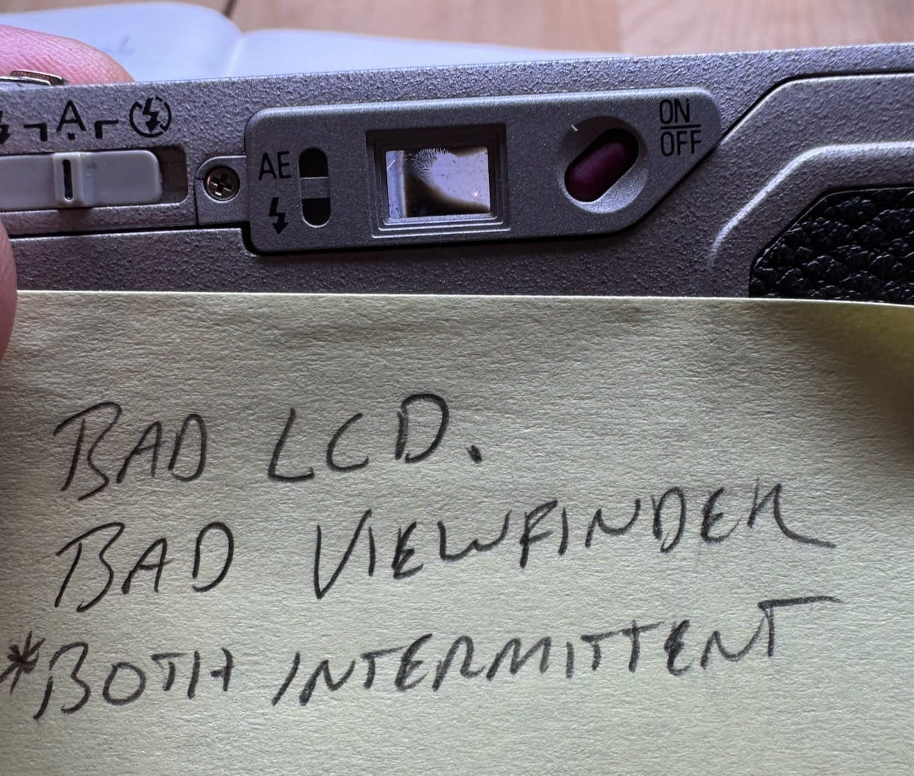

I have been thrilled to be able to use my little GR1 again, after pulling it off the shelf and finding that it does actually work. Except this morning I was reminded why I'd retired it before. The viewfinder becomes blocked by something loose in there or perhaps some sort of separation. Either way, it's not usable when this happens, so I may have to document the issue and re-retire the camera.