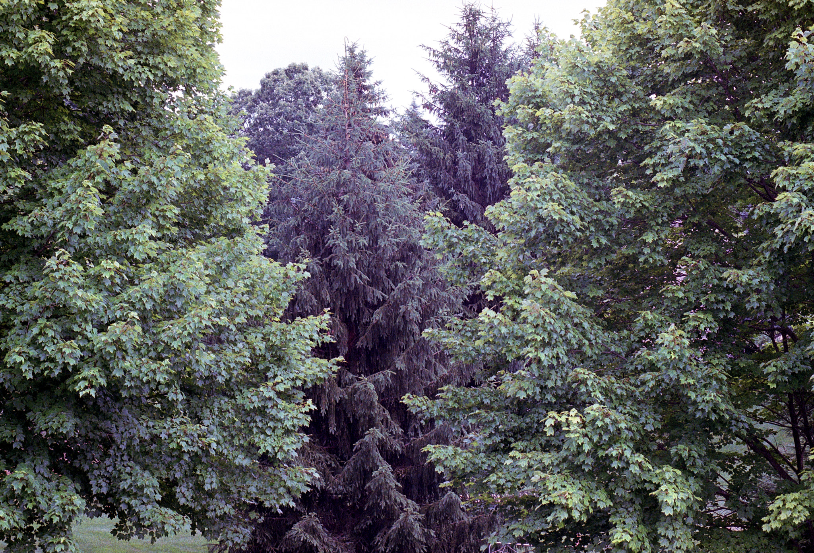
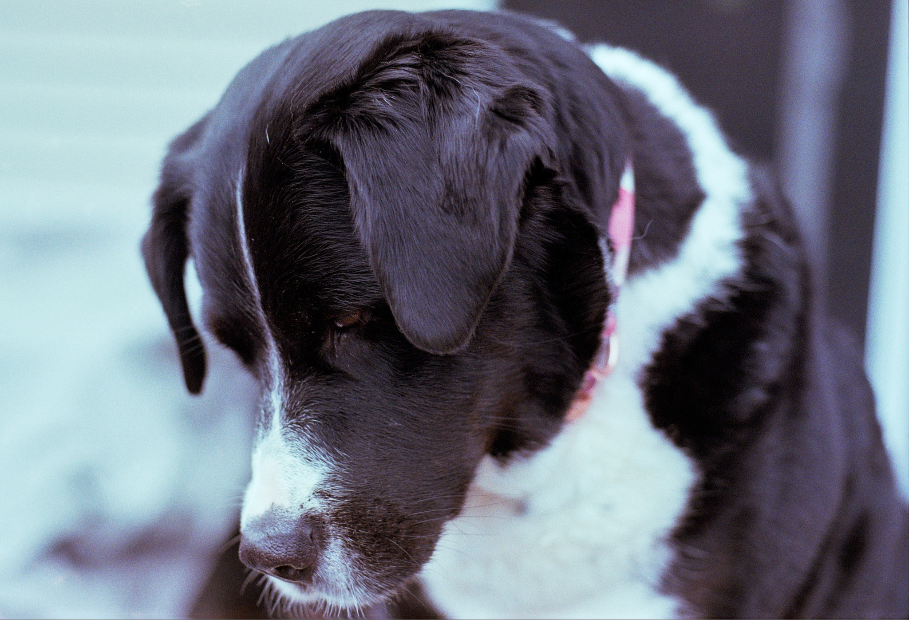
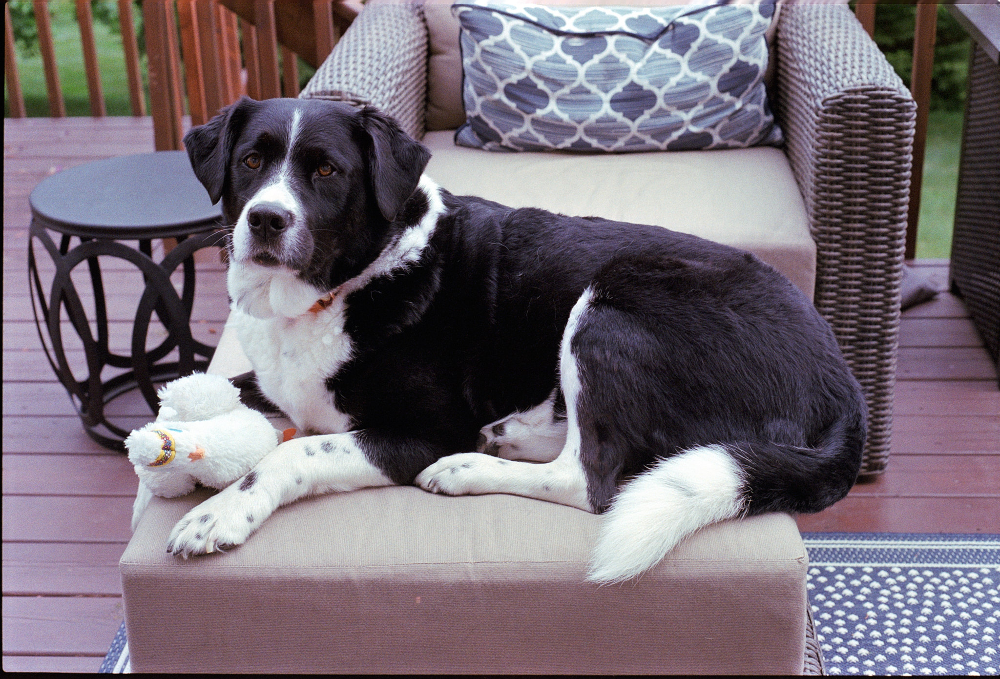
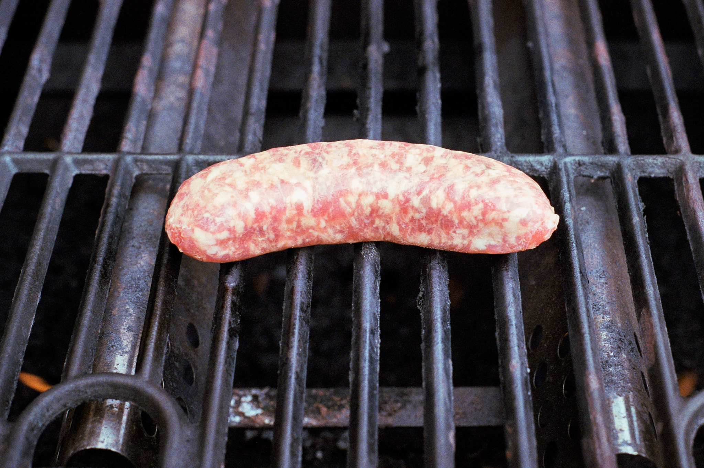

A roll of Kodak Gold 200 was languishing in the Nikon F100, so I used it up taking photos of Alice on our deck. Turns out that's what I did with the first half of the roll, too :)

Processed C-41 in the JOBO and scanned on the V850 using SilverFast.

