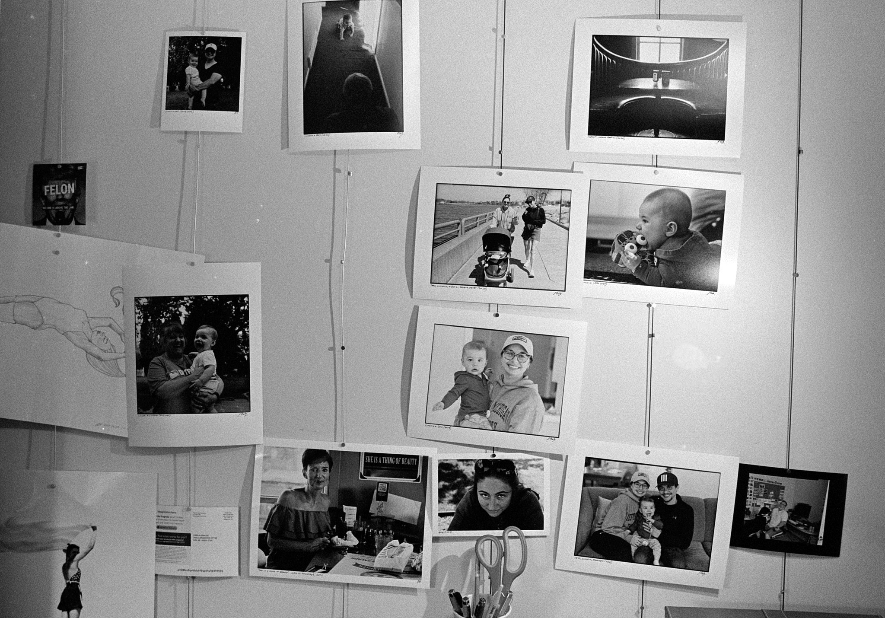
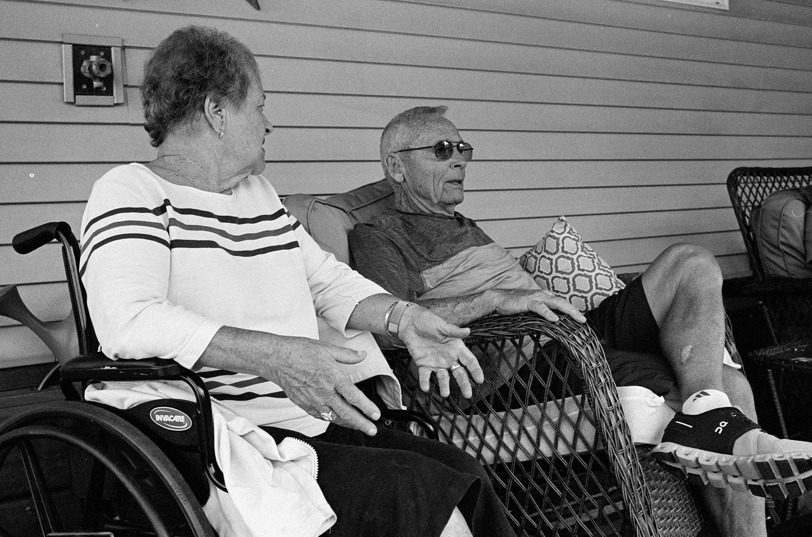
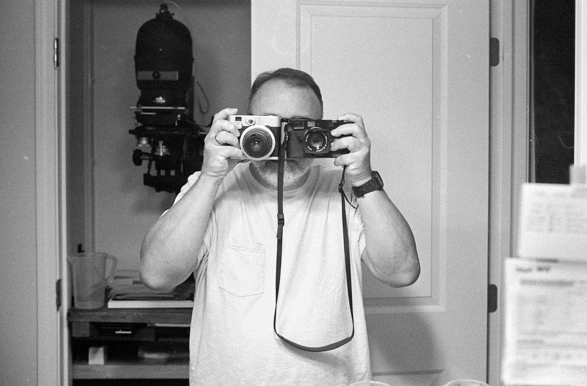
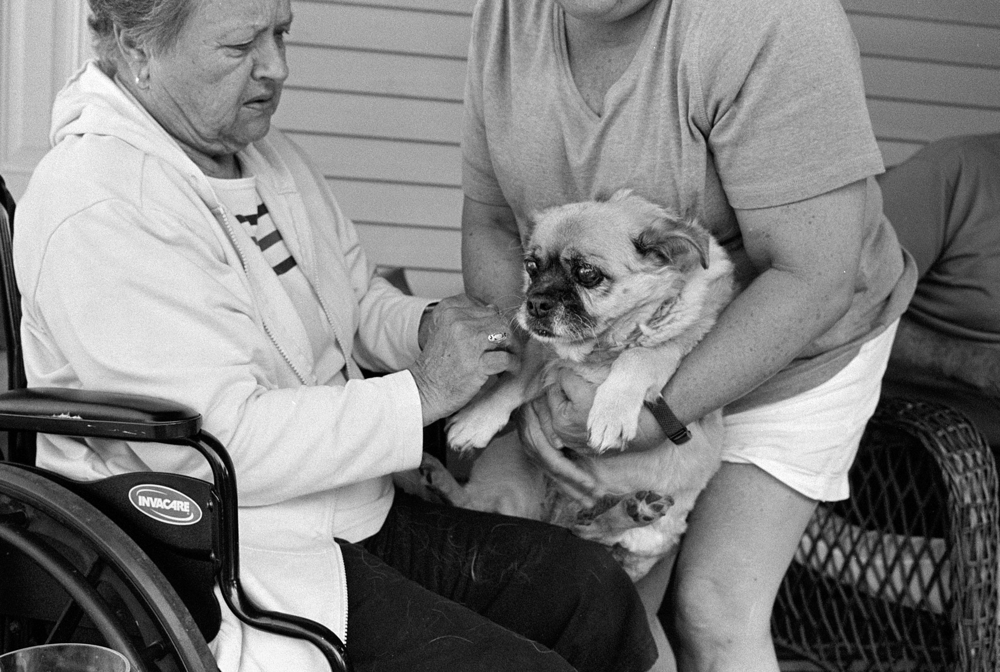
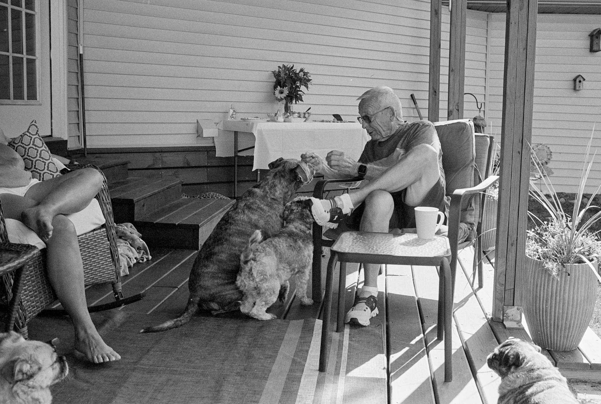
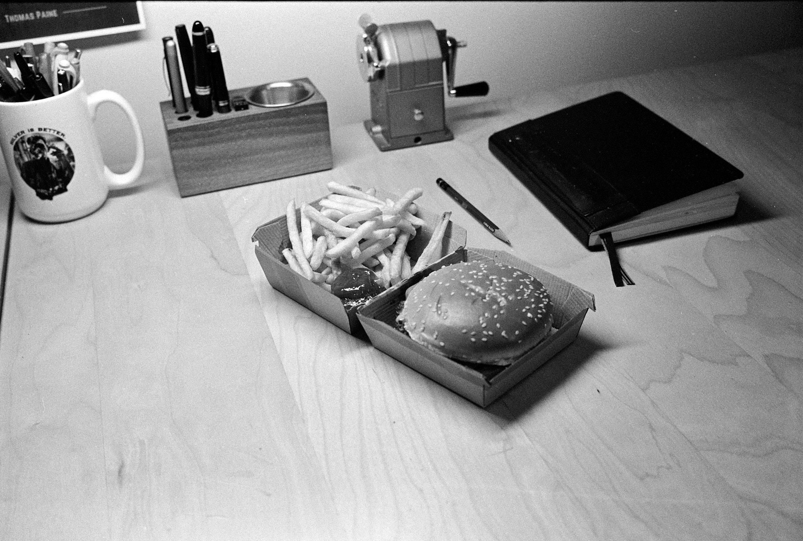

This roll is mostly uneventful. It's meaningful to me only in that there's a few photos from my mom and dad's 62nd anniversary this week. The rest are mostly just me plinking around the house. I mean, there's a photo of a cheeseburger on my desk, which is telling.

Shot with the Leica MP on HP5 using the 35mm Summilux.

