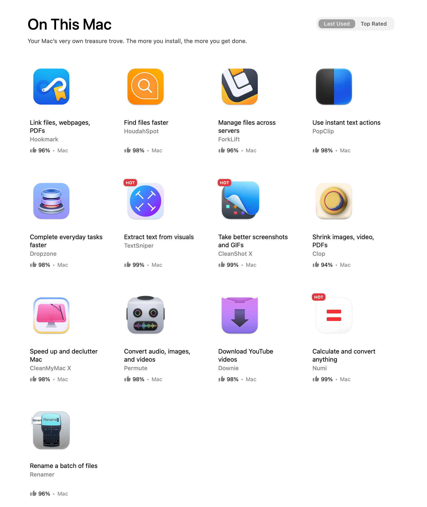
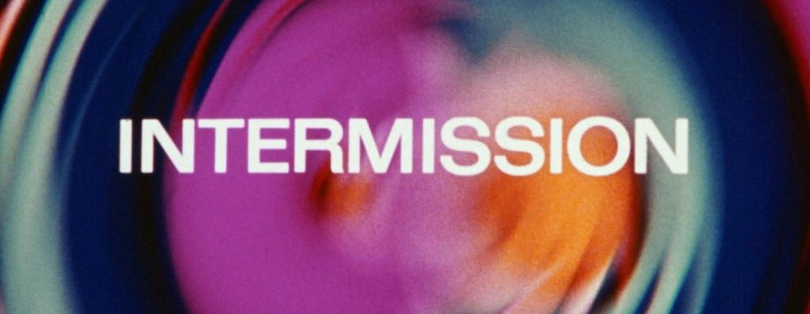
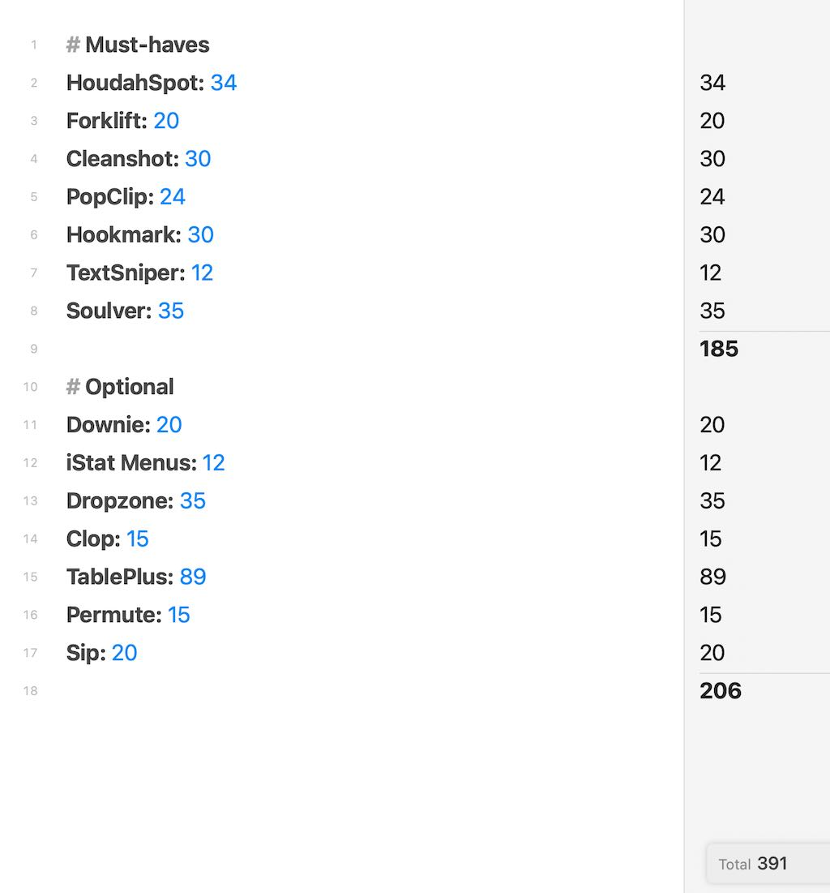

My [SetApp](https://setapp.com) subscription was scheduled to renew today, but I didn't let it. I figured that if I buy the apps outright that I actually use, I'll spend around the same amount as I would on a 1-year SetApp license for both Macs. The purchased apps would either come with lifetime licenses or a small annual upgrade fee. This means next year I'll pay a much smaller amount for all the same software. 

Here are the apps I currently have installed:

On the other hand, I'll no longer have access to 250+ fun apps to try. Normally I would consider this a bad thing, but I'm still working toward my Reduce & Simplify goals, and that means striving for less software, not more. It's fun tinkering with various apps, but honestly, it's an unnecessary distraction.

And then....

It turns out that the answer to the question, "How long can I go without SetApp?" is "about 30 minutes"

I took a closer look at the apps I have installed and use frequently, and also the ones that I use occasionally and then uninstall. The math got a bit more complicated.

So, I just paid $135 to renew my SetApp subscription for two Macs. As for the urge to tinker, I guess I'll just have to learn some restraint :).

