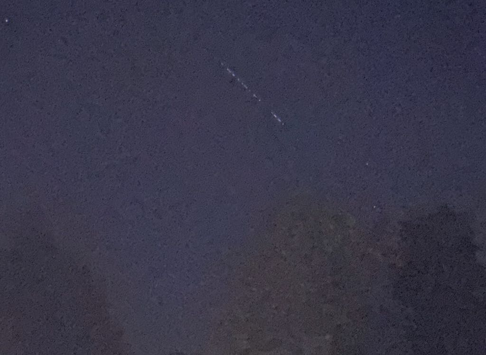

While walking Alice this morning, I saw a strange row of lights in the sky. It was stationary, so I knew it wasn't a meteorite. It didn't look like a comet. When I got home I did a quick search and it turns out it was a chain of Starlink satellites. There was a time I would have been amazed and optimistic about the technology. Instead, I just thought, "Fuckin' Musk."
