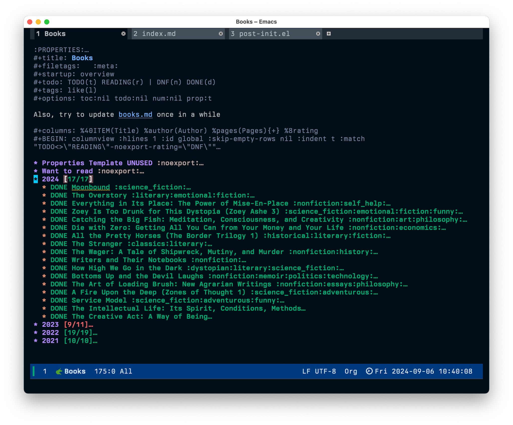
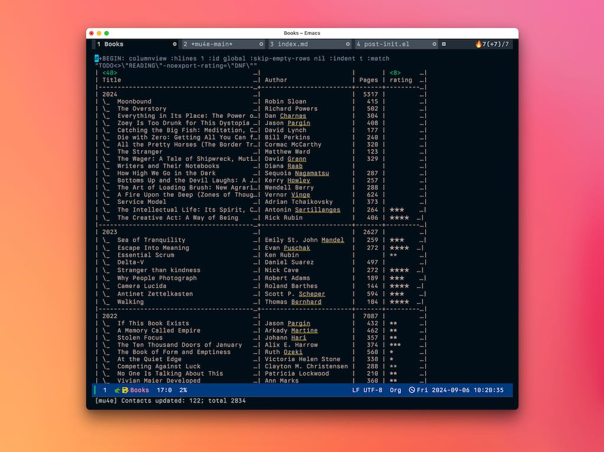

For a couple of years, I kept my [reading list in an Org-mode file](https://baty.blog/2022/book-logging-in-emacs). I found it a bit tedious, and the only thing I did about that was to stop doing it. I mean, I always seem to be on the verge of abandoning Emacs anyway, right?

Well, I'm back in Emacs, hard, so I want my books there again. I started out by building a capture template for adding books. This should be fine, but just for grins I did a quick search and found the [org-books package](https://github.com/lepisma/org-books). This looked like more than I needed, but I tested it anyway. Turns out I liked it. The problem was that it required Helm, which I don't use, and some of the functions weren't working for me. Then I found [this fork by goderich](https://github.com/goderich/org-books) which removed some dependencies, fixed some issues, and added support for TheStoryGraph.

I forked the goderich fork, tweaked a couple of things, and was off and running. I caught up with 2024's books. It was so easy this way!


To add a book, I copy its URL from [TheStoryGraph](https://thestorygraph.com) and call `org-books-cliplink` and the book and metadata are added for me.

The configuration for org-books is pretty straight-forward[^moved]:

```lisp
(use-package org-books
  :ensure t
  :load-path "~/.config/emacs/lisp/org-books"
  :config
  (setq org-books-file "~/Documents/Notes/Denote/20230406T053322--books__meta.org"))
```

Since several of the :PROPERTY: names were the same as my old template, the column view works just fine.


I need to clean up the inconsistent rating display and scale, but otherwise this is nice. And it's now easy enough that I might actually keep it updated.

[^moved]: Yes, I converted my books.org file into a Denote note.


