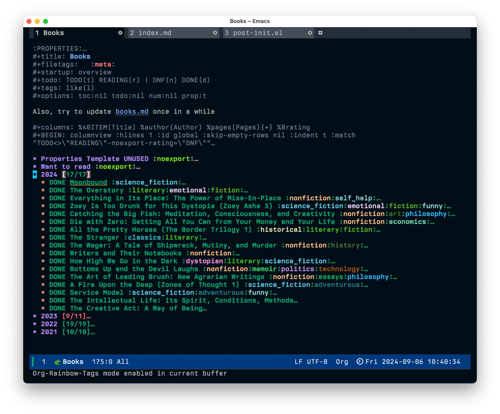

I don't normally use tags in Org-mode files, so I hadn't noticed that tags on DONE headings use the same face as the heading itself. This makes the tags difficult to spot. Every theme I tested failed to differentiate between heading text and tags on DONE headings.

Here's my books.org file:


After failing to find an easy way of changing the face of tags, I cheated and installed [org-rainbow-tags](https://github.com/KaratasFurkan/org-rainbow-tags). Now my tags are wildly different from the headings. And from each other, for that matter:



I'm not sure I like this for _every_ org-mode file, however, so I only enable the mode in my books file. This is done by setting a local variable in the file itself, like so:

```lisp
;; Local Variables:
;; eval: (org-rainbow-tags-mode)
;; End:
```

