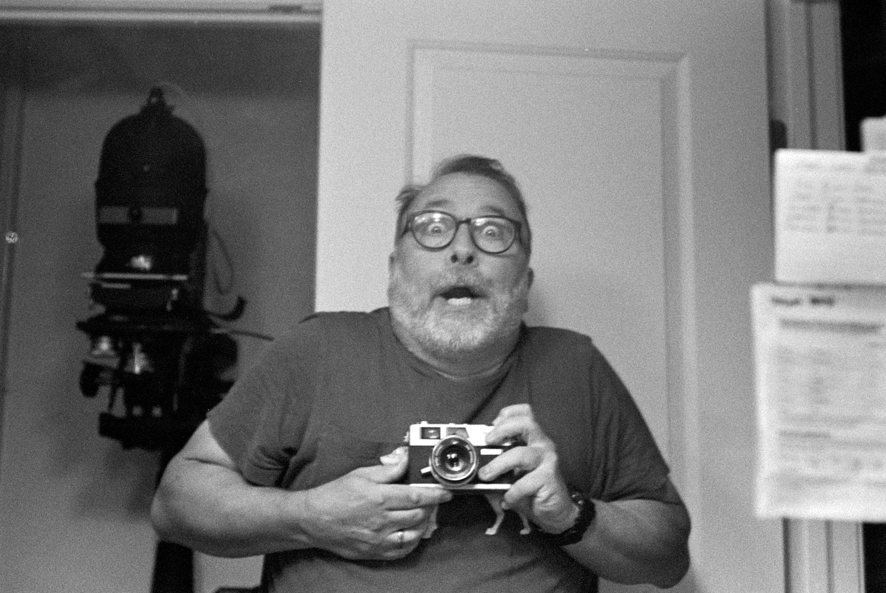
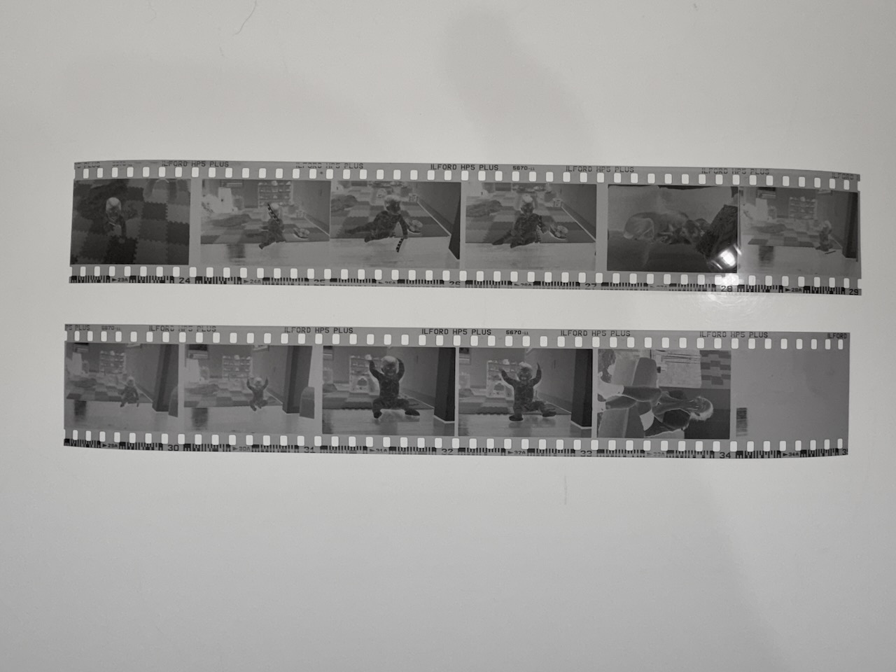
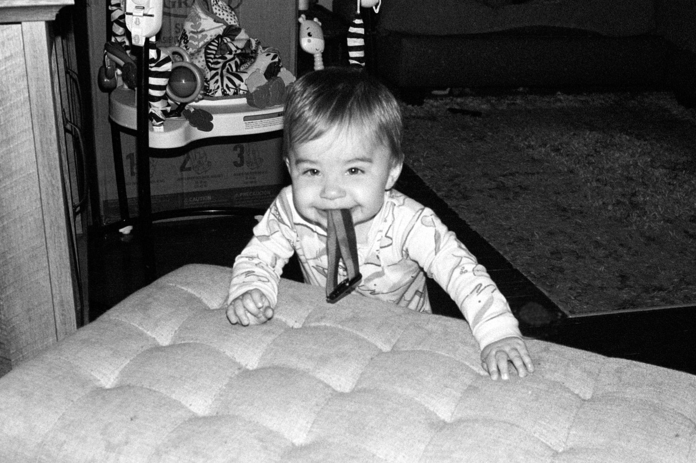
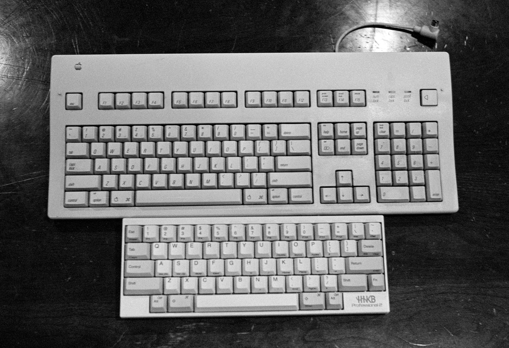
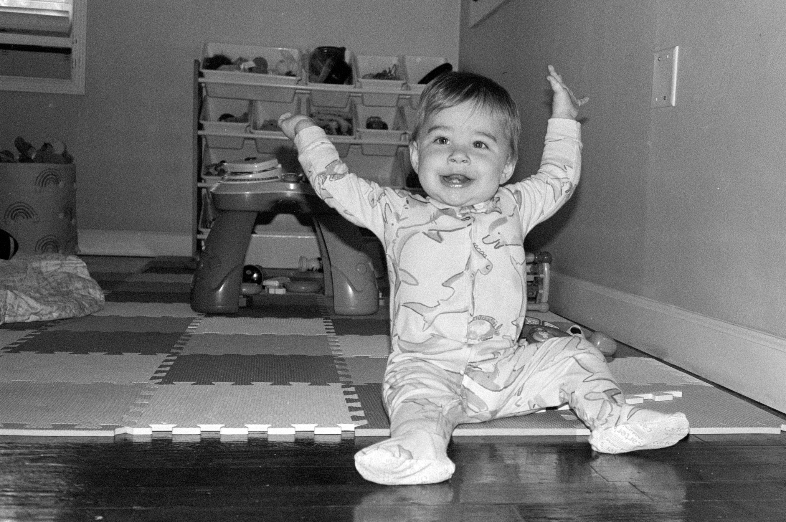
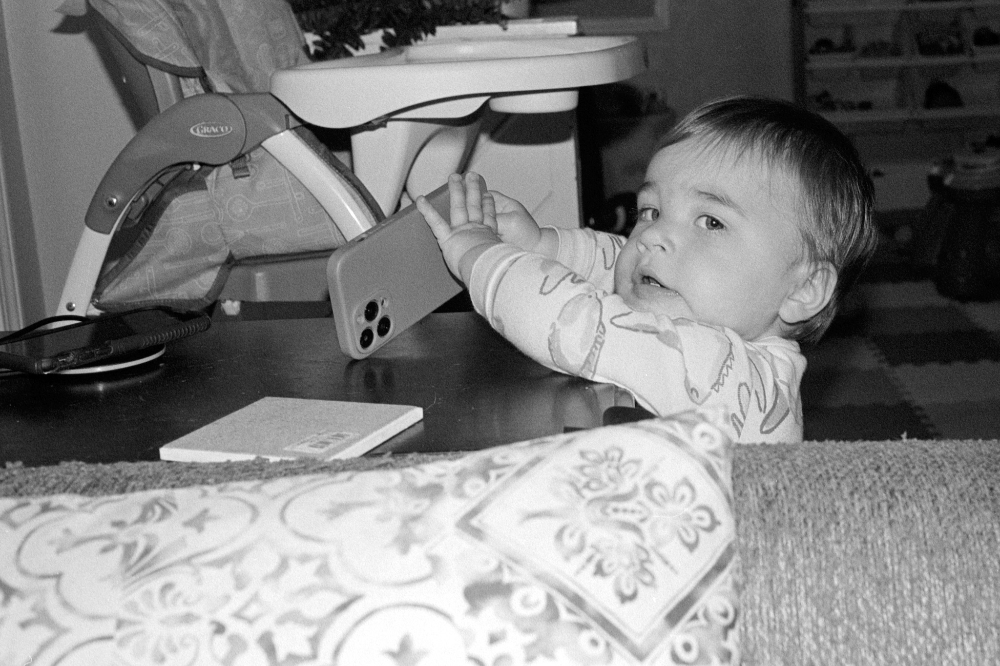

I first decided to [sunset the Canonet](https://baty.blog/2022/10/sunsetting-the-canonet), in 2022 due to a few issues making it less than ideal to use. I have a short memory, and was feeling badly about the camera sitting on a shelf, so I loaded it up with a roll of HP5.

Processing the roll yesterday reminded me why I'd set it aside:

<!--more-->

> I can’t seem to focus it and I don’t trust the shutter speeds. Also, it has scratched a couple of negatives and the frame spacing is all over the place.

All of these things are still true, and focusing is even more difficult than I remember. Something's up with the rangefinder, that's for sure.

Just look at the frame spacing from this sample...

Since I was mostly indoors, and focusing is difficult, I slapped a manual flash on top so I could shoot at f/8 @125th. I completely guessed at exposure, but was close enough.

I think it's time to retire the Canonet for real this time.

