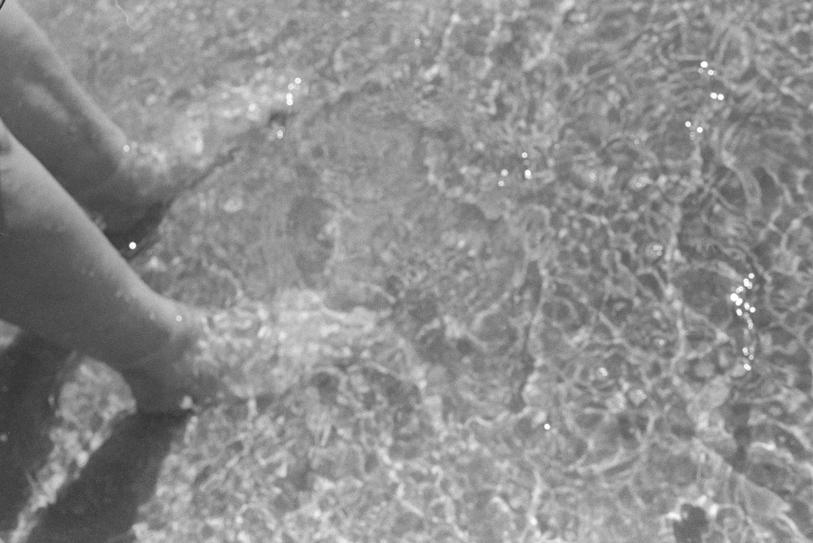
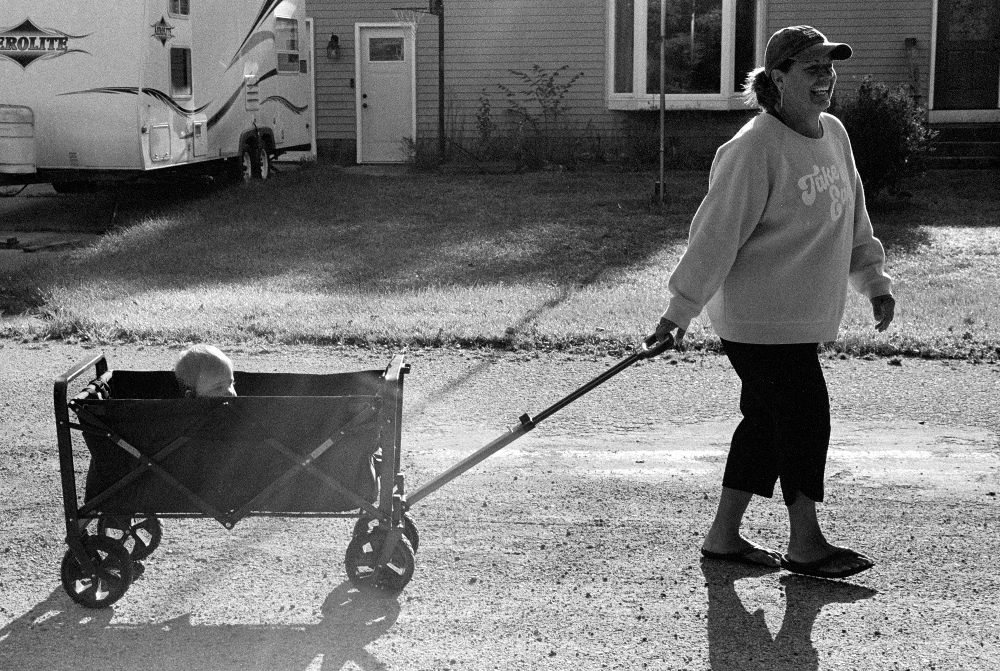
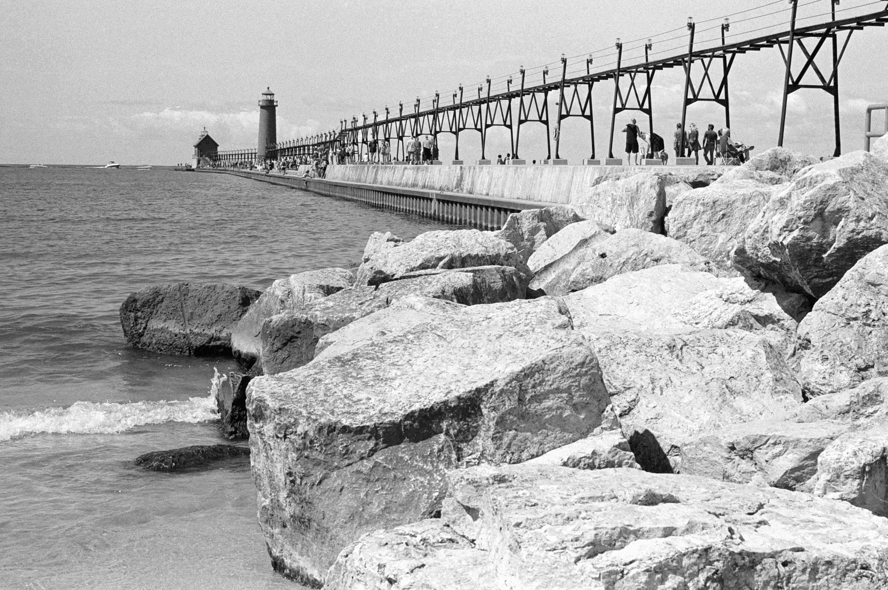
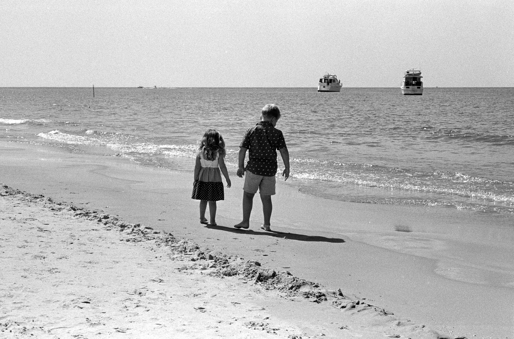
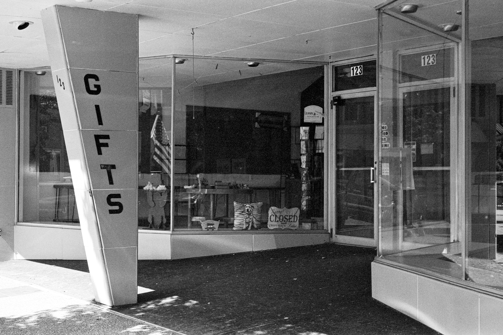

This roll of HP5 from the Leica M3[^oops] was shot mostly in Grand Haven during one of our frequent walks through town and on the pier.

[^oops]: It was the M3, not the MP as the post's original title said.
