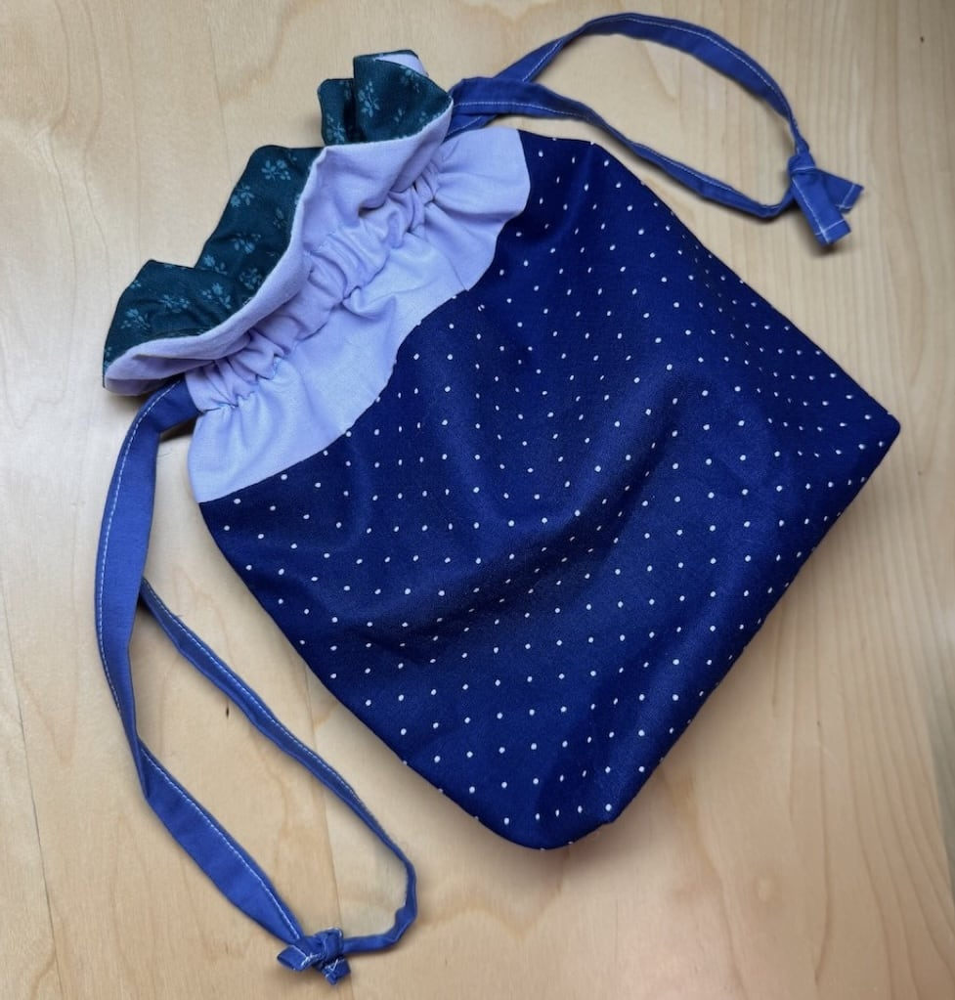
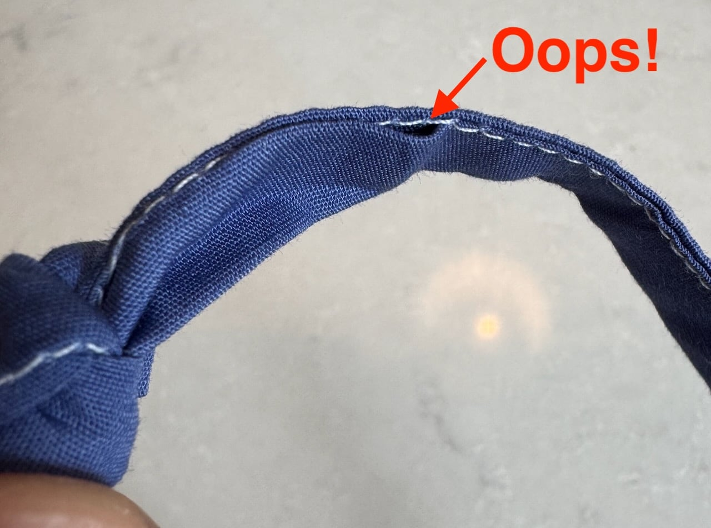

I'm still taking sewing lessons. The first week we made pillowcases and it was actually fun, other than having to rip a whole seam and start over :).

Monday's project was this drawstring bag. 

This was my first time cutting fabric, and I found it harder than expected. There's nothing to work against for the first cut, if you know what I mean. After taking forever figuring out the cuts, I was having trouble with my sewing machine. I still haven't figured out what the problem was, but it seems OK now. The class is 3 hours long and I was there for 3.5 hours and still didn't get to the drawstring. I finished the drawstring this morning. It was tricky because I don't have an edgestitch presser foot for my machine, so I was a bit all over the place. I missed a small section, but I'm choosing to ignore it.

Sewing is hard, but it's really cool to walk in with a random pile of fabric and walk out with an actual thing I made with it. Can't wait until next week.
