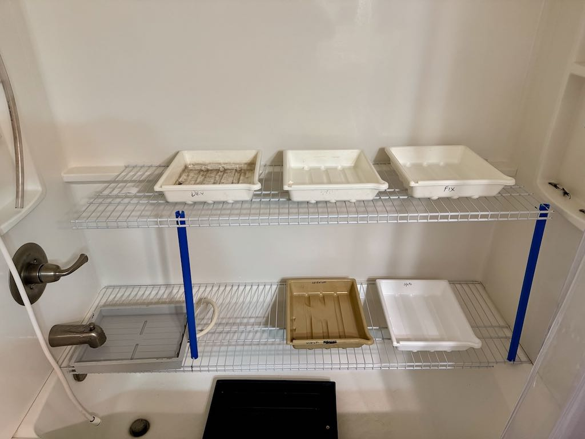

I made some quality-of-life improvements to the ~~bathroom~~ darkroom this morning. I finally have a real "wet side". Previously, I was using the sink and counter, but there was barely room for 3 (8x10) trays. Now, I've got room for 6 or more. Or larger trays if I want to print bigger.

It's just two cut-to-size closet shelving sections and some PVC for support. It's a little rickety, but I can set it up or tear it down and store everything in about 30 seconds. 

