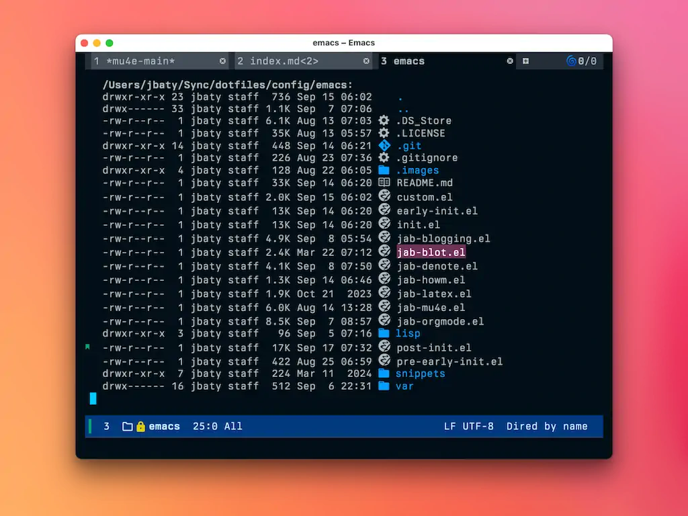
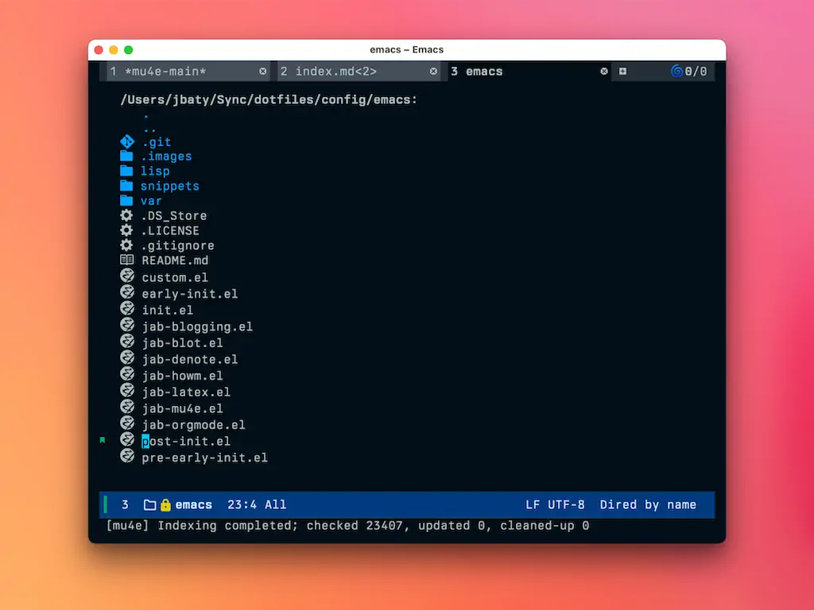

At some point during my latest round of build-emacs-config-from-scratch, I must have missed part of my [Dired](https://www.gnu.org/software/emacs/manual/html_node/emacs/Dired.html) settings.

I want Dired to only show the file name rather than all the file attributes, and I want folders displayed first. Instead, now I see all file details and folders are sorted alphabetically right along with files. Like this:



The first thing was to sort so that folders show first. I figured it would be as simple as adding the ` --group-directories-first` switch to `dired-listing-switches` but nope. The default `ls` binary in macOS doesn't handle that option. To get it, I needed to install the "coreutils" package via Homebrew (`brew install coreutils`).

coreutils prefixes binaries that have the same name as a macOS counterpart with "g", so their version of `ls` is actually `gls`. Rather than depend on shell aliases that sometimes don't seem to get picked up correctly in Emacs, I found a handy snippet of lisp and modified it like so:

```lisp
(when (eq system-type 'darwin)
    (let ((gls (executable-find "gls")))
      (when gls
        (setq dired-use-ls-dired t
              insert-directory-program gls
              dired-listing-switches "-aBhl  --group-directories-first"))))
```

I added that to the package configuration for Dired and it worked like a charm.

Next was to get rid of all the extra information shown by default in directory listings. 99% of the time I don't care about permissions, ownership, or file sizes. I just want the file names. Dired has a built-in function for this: `dired-hide-details-mode`. To make sure this gets run for every new Dired buffer, I added a hook:

```lisp
:hook
    (dired-mode . dired-hide-details-mode)
```

Now it looks how I like it:



I can always toggle the file details back on by pressing `(`.

FWIW, here's my entire dired configuration:

```lisp
;; Dired
(use-package dired
  :ensure nil ;; built-in
  :defer t
  :hook
    (dired-mode . dired-hide-details-mode)
  :config
  (setq dired-dwim-target t)                  ;; do what I mean
  (setq dired-recursive-copies 'always)       ;; don't ask when copying directories
  (setq dired-create-destination-dirs 'ask)   
  (setq dired-clean-confirm-killing-deleted-buffers nil)
  (setq dired-make-directory-clickable t)
  (setq dired-mouse-drag-files t)
  (setq dired-kill-when-opening-new-dired-buffer t)   ;; Tidy up open buffers by default
  (when (eq system-type 'darwin)
    (let ((gls (executable-find "gls")))
      (when gls
        (setq dired-use-ls-dired t
              insert-directory-program gls
              dired-listing-switches "-aBhl  --group-directories-first")))))
```


