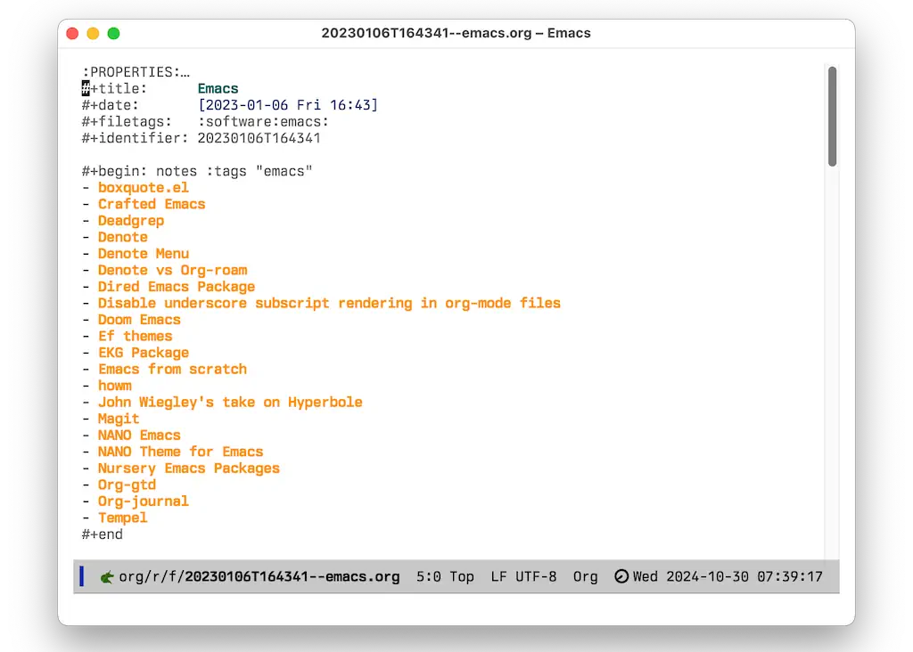
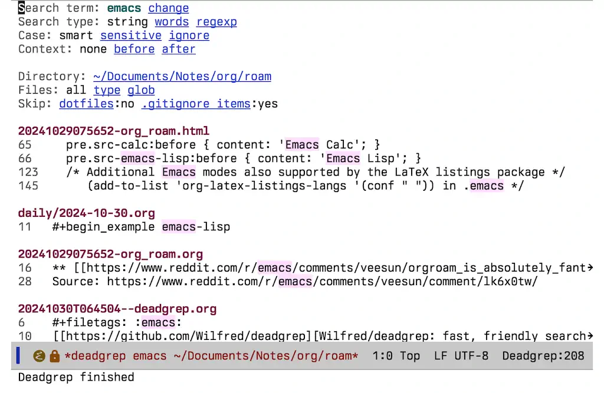

I've decided to dive back into [Org-roam](https://orgroam.com) and see how it feels. I've [done this before](/2023/03/back-to-org-roam/), but eventually moved back to [Denote](https://protesilaos.com/emacs/denote). I love Denote's simplicity, but I have noticed that I don't take advantage of many of its main advantages. For example, I _always_ use Org-mode files, never Markdown or plain .txt. I almost never filter my files based solely on components of their names. I like using multiple tags, but doing so makes Denote filenames even more unweildy. And so on.

How did I end up back in Org-roam? I summed it up yesterday, so [start there](/journal/2024/10/29/today/#round-and-round-with-roam-and-friends).

I'm getting over my internet-induced fear of "lock-in". I mean, Org-roam uses a (GASP!) database! Who in their right mind relies on a database for managing their precious plain-text notes? 🙄🙋‍♂️. You can call it lock-in if you want, but the first requirement for my notes is that they are as useful as possible to me..._today_. If that means there's a chance they end up less useful in some hypothetical scenario 20 years from now, I don't care. Besides, they _will_ be useful in 20 years. They're still just plain text. The database is only a wrapper around a bunch of text files, so without that the only important thing I lose is the convenient linking and backlinks, etc. So they'll just be a little less useful, I suppose. That's fine, and a trade-off I'm willing to make.

One thing I'm doing to help with future-proofing is to use [org-roam-dblocks](https://github.com/chrisbarrett/nursery/blob/main/lisp/org-roam-dblocks.el) from Chris Barrett. This lets me "burn" backlinks or query results directly into the files, removing the need for the database-ey bits. Here's an example:




```lisp
(use-package org-roam-dblocks
  :after org-roam
  :load-path "~/.config/emacs/lisp/nursery/lisp"
  :hook (org-mode . org-roam-dblocks-autoupdate-mode))
```

I have it configured to automatically update whenever the file is opened/saved. That helps. Without this, though, there's always search 😀.

Speaking of search, I've configured the wonderful [Deadgrep](https://github.com/Wilfred/deadgrep) as the default way I search in Org-roam. It required that I write a small lisp function, but it works great. I love Deadgrep.

```lisp
(defun jab/search-roam (search-term dir)
      "deadgrep in org-roam-directory"
      (interactive (let ((search-term (deadgrep--read-search-term)))
                     (list search-term org-roam-directory)))
      (deadgrep search-term dir))
```


Here's what the Deadgrep search results look like:



That [earlier post](/2023/03/back-to-org-roam/) explained why I like using Org-roam, but here's a quick list:

- Any org heading can be a node
- Aliases
- Multiple tags without cluttering up the file names
- Feature-rich Daily notes functionality
- Org-roam-refile

I even like the Graph made possible by org-roam-ui, even though I make fun of it.

I am hedging my bets just a little, though. My default ` org-roam-capture-template` creates new files using Denote's default format. It also includes the `#+identifer:` front matter that Denote uses. While I don't intend to use both Denote and Org-roam [like I used to](/2023/08/using-both-denote-and-org-roam/), it's nice to know that I can.


