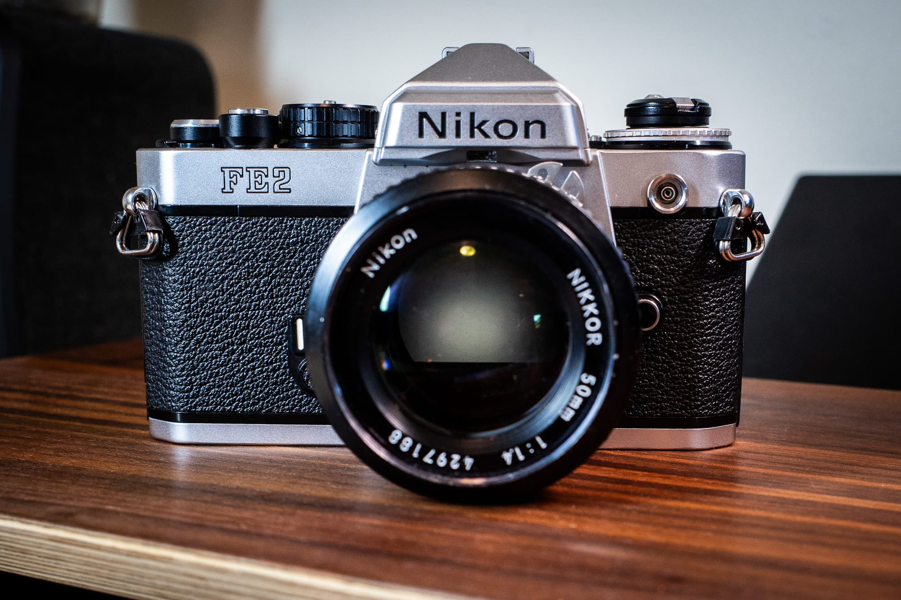
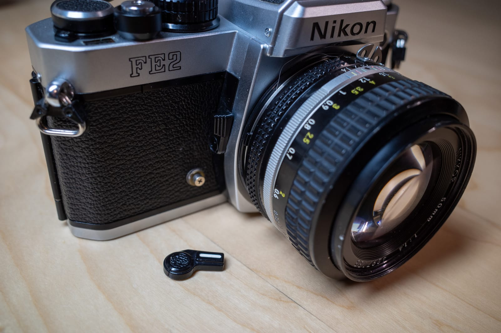
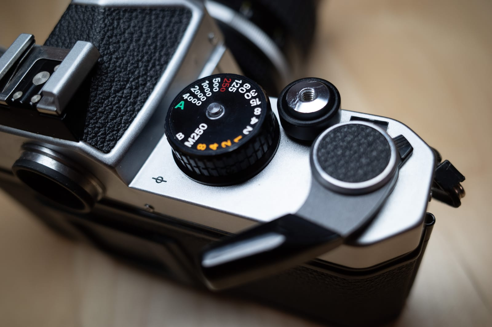

I recently purchased a nice Nikon FE2 from KEH.com. It wasn't expensive, and after using the FM2n for a bit, I wanted to try something like it, but with automatic exposure. The camera is lovely.

I've put one roll of film through it. As expected, the match-needle metering in the viewfinder is much more to my liking than the LED version in the FM2n. It's how I like a meter to work, given a choice.

The first roll's results were meh. This wasn't the camera's fault, but there was nothing there that jumped out at me, image quality-wise.

Then this happened:

The self-timer lever fell right off when I tried using it. This should be easy to fix, but I'm not going to bother.
I could exchange the camera for one without a broken self-timer. Or I could fix the one I have. Except this wouldn't solve the biggest problem with the FE2, and that is the need to pull out the shutter advance in order to turn the camera on.

I thought I could get used to it, but I consider it a design flaw and I hate it. I miss shots. I'm left-eyed, so it pokes me in the eye and generally annoys me.

I've also noticed that to continue using the camera, I'd need a diopter.

So, the camera is going back and I won't be replacing it. I'm happy I got to try it, but it's just not for me.