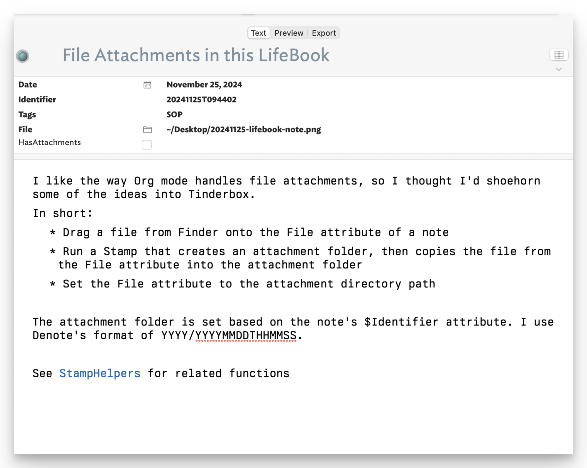

Every note-taking app handles file attachments differently. Most of them do it poorly. What I've found surprising is that I actually like what Org mode does with attachments. I might be the only one who does.

The way I have Emacs configured, dragging a file into an open buffer window will prompt me with a few options, the one I use being "Attach file". This then copies the file into a subfolder of whatever directory is configured as the `org-attach-directory`. This subfolder is named based on any ID property set in the Org file. This means I end up with a directory tree that looks like this:

    5f
    6d
    ├── ace650-30fb-4157-9e6e-a259f6b4b75e
    │   └── 20230820-Luigi-Ghirri .jpg
    ├── bffb46-e988-4e4e-864f-4ff0b9171068
    │   ├── Datavue Snap 1+1 Portable Computer-closed.jpg
    │   ├── Datavue Snap 1+1 Portable Computer-floppy.jpg
    │   ├── Datavue Snap 1+1 Portable Computer-front.jpg
    │   ├── Datavue Snap 1+1 Portable Computer.MOV
    │   └── Datavue Snap 1+1 Portable Computer.jpg
    └── ca2ca7-f6a8-415f-8b53-d607081fdda2
        └── Community Darkroom Project.tbx
    6c
    6e

You can see why someone might avoid doing this. Without the source .org file, all bets are off. I don't lose the source .org file, is all. Also, I try to name my files in a reasonable way, so using Spotlight as a fallback is feasible.

[Tinderbox](https://eastgate.com/Tinderbox), on the other hand, isn't much help out of the box with files. It has lots of file-based tooling, but the idea of managing attachments isn't one of them. So, I'm trying to finagle Tinderbox into working the way Emacs does. 

In Tinderbox, if you have a "File" attribute showing, you can drag a file from the finder into that attribute and it will set its value to the Path (e.g. "~/Desktop/funny-meme.jpg"). What I've done is create a Stamp that copies that file to my version of Org mode's "org-attach" tree (see above). 

It's hard to describe, but here's a quick rundown of how it works.

Instead of a uuid, I use a date string derived from the current time (e.g. "20241125T143431"). This is stored as a string in an "Identifier" attribute as soon as I create a new note in my LifeBook.tbx file. Here's the parts that do it...

    // Set some basic attributes in the new note, including the $Identifier
    $Date|=date("today");$Prototype="pJournalEntry";
    $Identifier|=fNoteIdentifier($Date);

    function fNoteIdentifier(vDate:date){
    	var:string id = vDate.format("yM0DThmms");
    	return id;
    };

Here's what that part of the note looks like after dragging a file onto the File attribute.

Once the File attribute has a value, I run a Stamp named "Attach".

    if($File){
    if($Identifier==""){$Identifier=fNoteIdentifier($Date)};
    var:string vSourceFilePath=$File.substr(1); // remove tilde
    var:string vSourceFileName=vSourceFilePath.split("/").at(-1);
    var:string vAttachmentDir=$Text("/Config/AttachmentDir");
    var:string vDestDir=fNoteAttachDir();
    var:string vCmd="mkdir -p " + vDestDir;
    vCmd+=' && cp "$HOME' + vSourceFilePath+'" "'+vDestDir+'/"';
    $HasAttachments=true;
    $Text(/Debug)=vCmd;
    $Text(/Debug)+=runCommand(vCmd);
    $File=vDestDir;}

    function fNoteAttachDir() {
    	var:string vAttachmentDir=$Text("/Config/AttachmentDir");
    	var:string vDestDir=vAttachmentDir+"/"+$Date.format(y)+"/"+$Identifier;
    	return vDestDir;
    }

Without going too far into the weeds, this stamp runs a shell command that creates the appropriate target directory and copies the $File into it. It then sets $HasAttachments to true and finally, sets the original $File attribute to the attachment directory. This last bit means I can click on that little folder icon and it will open the folder in Finder.

I'm using a simpler file tree using subfolders based on the year in the Identifier:

    .
    └── 2024
        ├── 20241125T121015
        │   └── USPS-OM-2n.pdf
        └── 20241125T143431
            └── Donation Receipt — Thank you from the Internet Archive.eml

It probably seems more complicated than it is. The whole process is 

1.  Drag file onto the document
2.  Select "Attach file" from the Stamps menu.

If this all seems terribly overwrought, that's because it is. I just wanted to see if I could do it. It's not _exactly_ the same as Org mode, but it's close enough for who it's for.