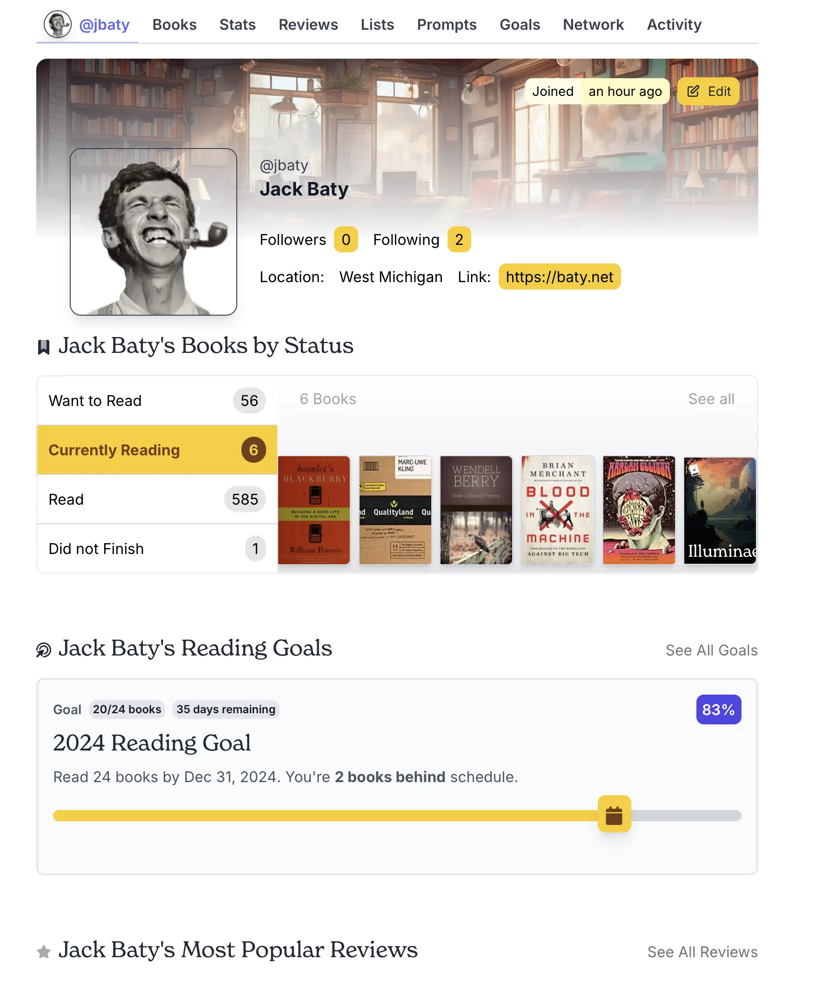

All I want is [Letterboxd](https://letterboxd.com/) for books. LibraryThing is the Craigslist of book trackers. Goodreads is icky. TheStoryGraph has a layout I don't get along with. Bookwrym is decent, but doesn't feel that great. Plus, I don't care if my reading list is "federated".

I asked about this on Mastodon, and [@johnke](https://social.lol/@johnke) responded, suggesting [Hardcover](https://hardcover.app/), which I'd never heard of. It was a good suggestion.

I imported all of my books from TheStoryGraph, which I'd previously imported from Goodreads, and I was off and running. Here's what it looks like:

What I like about it is that I can get to the books and lists that I want without too much fuss. StoryGraph was bad at this. Mostly, Hardcover shows me the things I want to see, where I expect to see them, so that's good.

What I don't like is that the website is slow. It's faster than TheStoryGraph, but still too slow. I also find the screened image in the header to be distracting. 

Some improvements I'd like to see: I think the Reading Goals section could be much smaller. I might even choose to hide it on my profile, if possible. The "Books by Status" section would benefit from putting the tabs/navigation at the top of the list of books. That would give more room for the actual books.

I'll run with this for a bit and see if it continues to feel right.