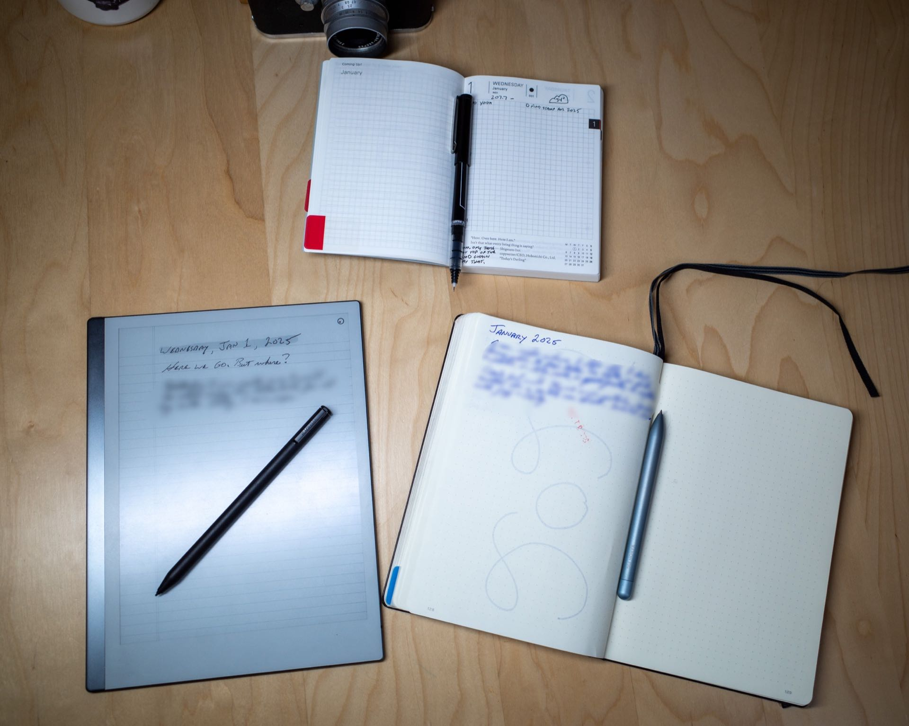

It's the same old story. I don't know whether I want to use one or multiple notebooks. Or even if I want to use paper notebooks at all. Here are some random thoughts about my intended notebook use for 2025.

Each year for the past 13 years I have ordered a Hobonichi Techo. Some years, I write in one nearly every day. Other years, I fill the first few pages, then it remains mostly blank for the rest of the year. This morning, I (optimistically, as always) set mine up for 2025.

My go-to notebook for journaling, logging, and bullet-journaling for years has been the Leuchtturm1917. It has an index, numbered pages, and decent quality paper. Or at least they _used_ to have good paper. The paper in the last couple have been worse. Flimsier, somehow. Show-through has been more pronounced, even with non-fountain pens. I hear they've released a version with heavier paper, so I may try one of those.

Paper type is an issue, too. I prefer 7mm ruled paper. The Leuchtturm uses 5mm and the one I'm currently using is dot grid. I don't like dot grid pages. They feel like a half-assed compromise between plain and ruled pages, rather than the best-of-both-worlds solution that some people claim. 

I am just over half-way through the current Leuchtturm. I planned to move to a nice 7mm ruled Midori MD Notebook for 2025, but I seem to always bail on notebooks before they're finished, and I'd love to stop doing that.

The dark horse here is the reMarkable tablet. If I was working, the reMarkable would be my tool of choice for meeting notes. I'm not working, though, so what is it for, then? I'm not sure. While the tablet is a terrific piece of hardware, it's not a paper notebook. Duh. The upside is that I can choose different paper types for every "notebook", and even on individual pages. I sometimes think that this device solves most of the problems I have with paper notebooks. Except it's not really paper, is it? I love the feel of paper. I love flipping back through pages. I love pasting in ticket stubs or little photos or magazine cut-outs. I love my pens. As good as the reMarkable is, it's not the same, and I don't think it's good enough to replace real paper. Sometimes I want the smell of a freshly-sharpened pencil.

Where does this leave me for 2025? Nothing will change, probably. I'd like to keep using the Leuchtturm until it's full. I'll use it to journal, log my day, write commonplace entries, record tasks, glue stuff, doodle, etc. Then, some days, I'll jot some todos or record some events in my Hobonichi, just as a change of pace.

You know, the usual.