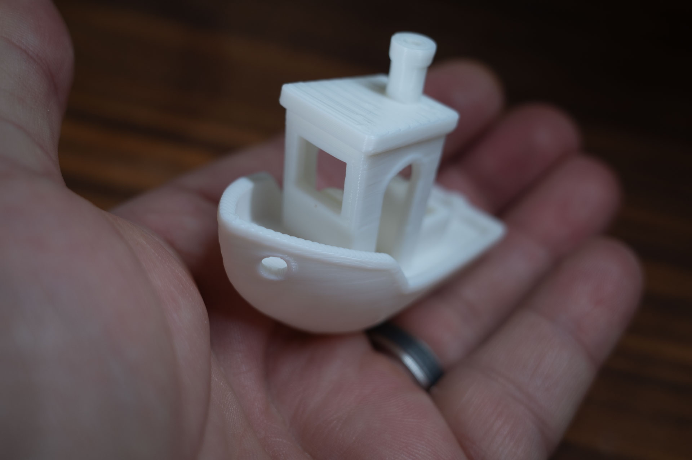
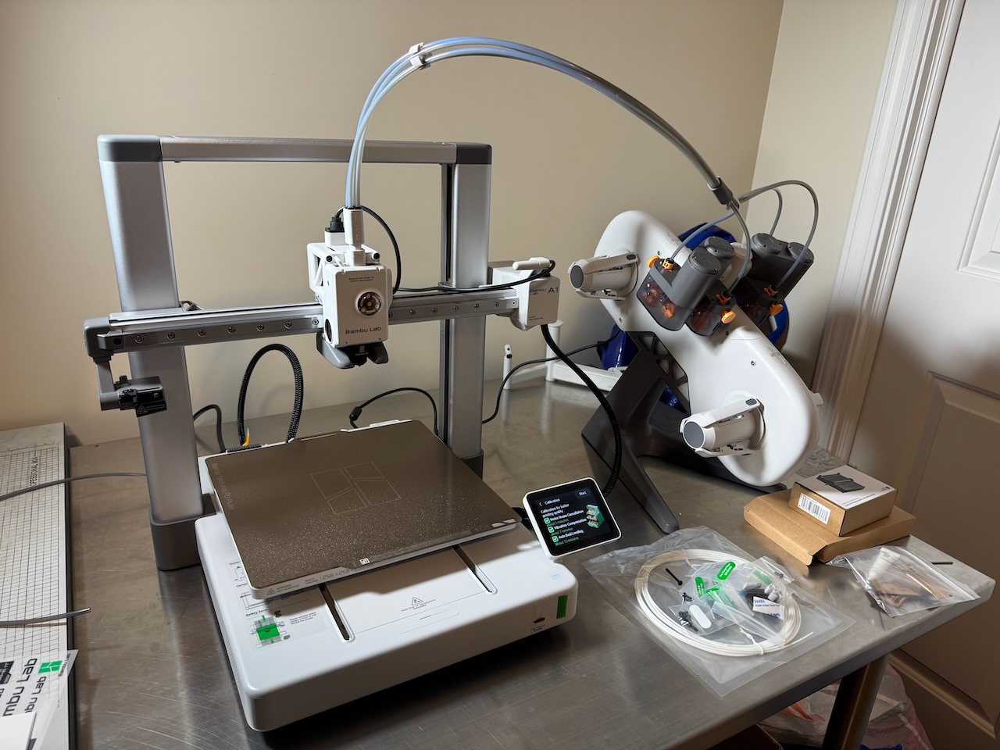

Back when I regularly maintained a "Spark file[^1]", I wrote the following on Aug. 26, 2012:

> Do something with a 3D Printer 
> 
> <cite>Me, in 2012</cite>

Today, I can finally cross that one off the list.

The [Bambu Lab A1](https://bambulab.com/en-au/a1) arrived yesterday, so I did what everyone does and printed the little "Benchy" tugboat. The A1 only came with 20g of filament, and of course I forgot to order more with the printer, so the starter filament is all I had to work with. It's so cute, though!l. k

3D printers have always seemed really cool, but also more trouble than they're worth. I'm as much a nerdy gadget-guy as anyone, but I never felt like being an expert in calibrating and maintaining 3D printers. In the past couple of years, printers seem to have reached a tipping point in ease-of-use, with the Bambu models seemingly leading the way.

I bought the lower-end A1 model because it seems like more than enough for what I need. Besides, I don't even know what I plan to print, to be honest. Here's the printer, set up and ready:

I have a roll of PLA filament arriving later today, so I'll probably spend the afternoon looking for ideas on what to print. I have no interest in printing toys or anime or Marvel characters. No Harry Potter props, etc. I'd like to make some useful things like tool holders or organizational gadgets. Eventually I'd like to make accessories for my film photography hobby, but I don't know what that might be yet. Seems like there ought to be something I could make, though.
Anyway, I'm happy to be able to try this new hobby. It's been a long time coming. I hope Benchy is just the beginning.

[^1]: See [The Spark File](https://medium.com/the-writers-room/the-spark-file-8d6e7df7ae58), by Steven Johnson
