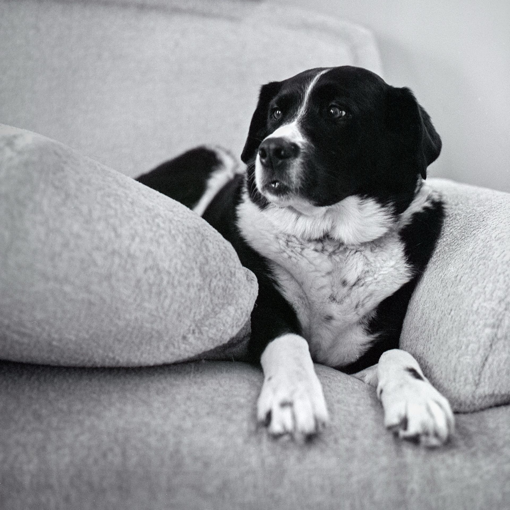
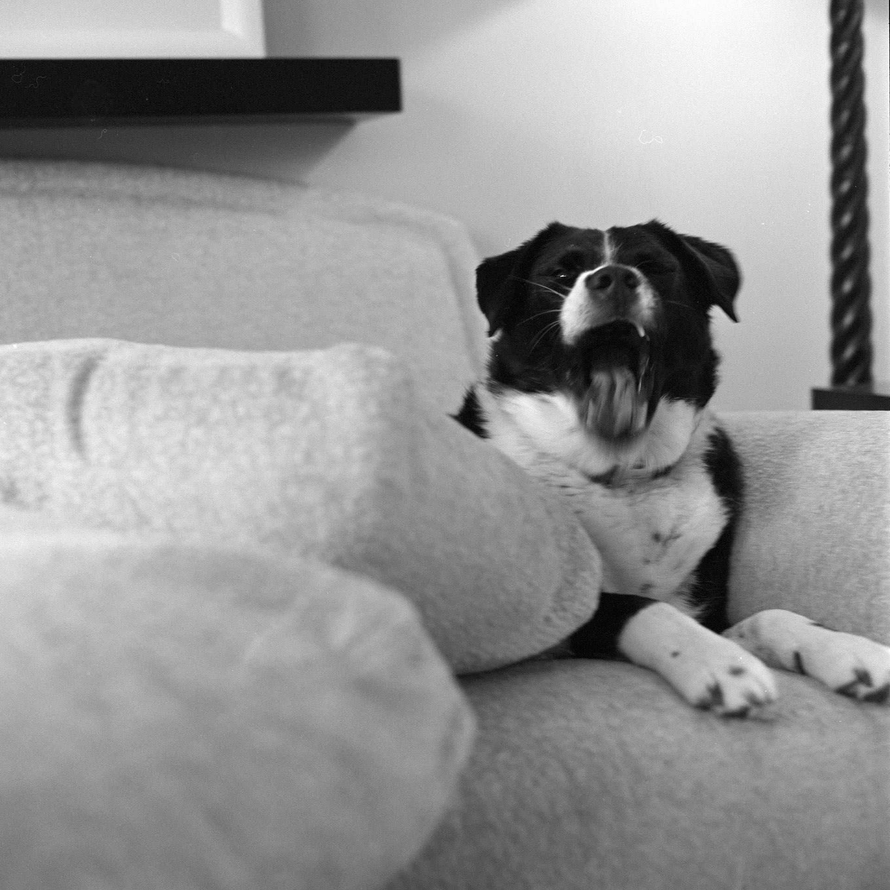

Sometimes I just need to blow through a roll when I'm bored. This is from the Hasselblad 500C/M and 80mm Planar on HP5 developed with HC-110(b). Thankfully, Alice was handy. These were all handheld at 1/30th, which is a terrible idea. The one of me is underexposed and full of dust. ¯\\_(ツ)_/¯

<!--more-->

