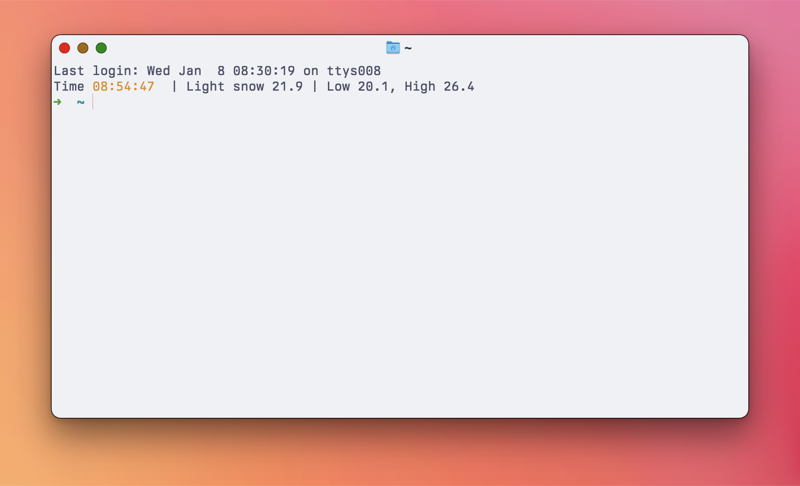

For some reason, I always want to know the weather conditions. I barely go outdoors, but I still like to know what's happening. I have a few shell scripts that kick out some version of the weather. Here's the one I use most:

```sh
    #!/bin/sh
    # Jack Baty, 2023 (https://baty.net)
    # Grab and parse weather info using WeatherAPI.com
    
    jq=/opt/homebrew/bin/jq
    
    # Save the response to temporary file
    # TODO: shouldn't this just be a variable or something instead?
    weatherfile=`mktemp`
    curl -s "https://api.weatherapi.com/v1/forecast.json?key=[SNIP]&q=49301&days=1&aqi=no&alerts=no" > $weatherfile
    
    now=`${jq} -r .current.condition.text ${weatherfile}`
    temp=`${jq} -r .current.temp_f ${weatherfile}`
    condition=`${jq} -r .forecast.forecastday[0].day.condition.text ${weatherfile}`
    high=`${jq} -r .forecast.forecastday[0].day.maxtemp_f ${weatherfile}`
    low=`${jq} -r .forecast.forecastday[0].day.mintemp_f ${weatherfile}`
    
    echo "${now} ${temp} | Low ${low}, High ${high}"
```

Right now, this returns: Light snow 21.9 | Low 20.1, High 26.4

I recently went back to using [Fish shell](https://fishshell.com/). Fish has a function called `fish_greeting` that returns a generic welcome message with each new shell. I changed it so that it shows the time and weather. My ~/.config/fish/functions/fish\_greeting.fish looks like this:

```bash
    function fish_greeting
        echo -n Time (set_color yellow; date +%T; set_color normal)
        echo " | " (~/bin/getweather)
    end
```

Neat, huh? Normally the weatherapi.com API is fairly responsive, but I can see this being a problem when it's laggy. I don't open _that_ many new terminal windows, so it's fine for now.
