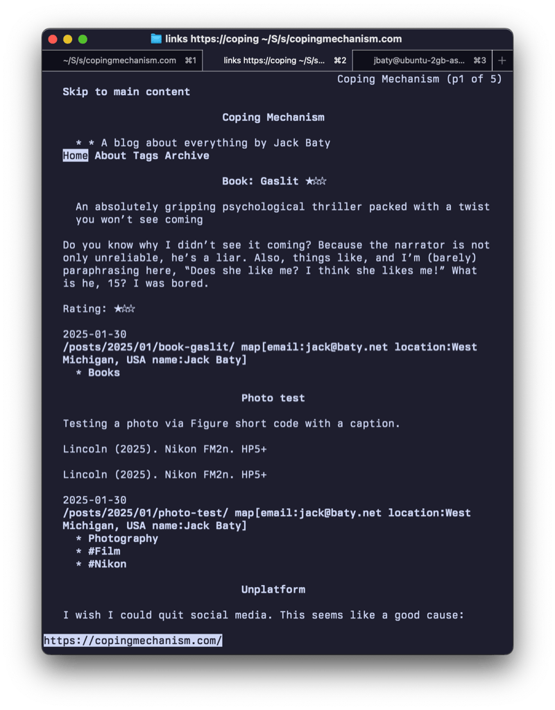

[Twibright Labs: Links](http://links.twibright.com/)

It's a Lynx-like web browser. I don't quite understand why I would want to use it for everyday browsing, but it's fun to see what sites look like without all the hubbub. Here's this site in links:

<!--more-->

